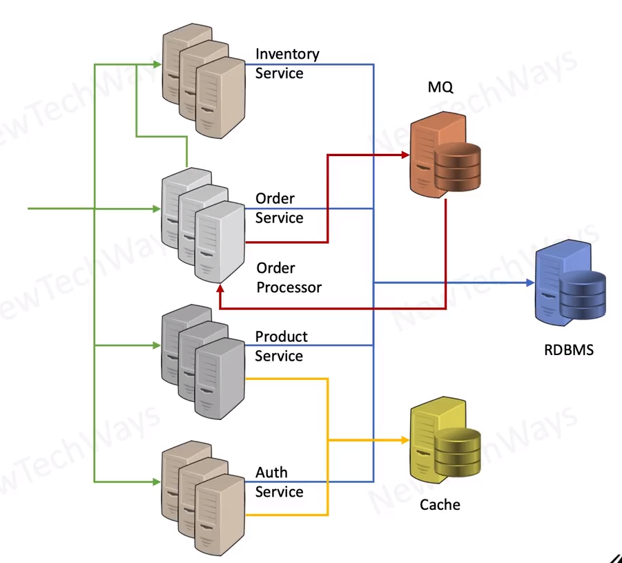

# Messaging Queue - Technology Selection

## Main Two Solutions
- RabbitMQ
- Kafka (extremely high scale)

- Kafka is a distributed queue for high scalability 
  - partitioning of queue
- kafka tradeoffs
  - complex setup, requires Zookeeper
  - message order only within a partition
  - no push message delivery
    - pull requires constant polling
---
