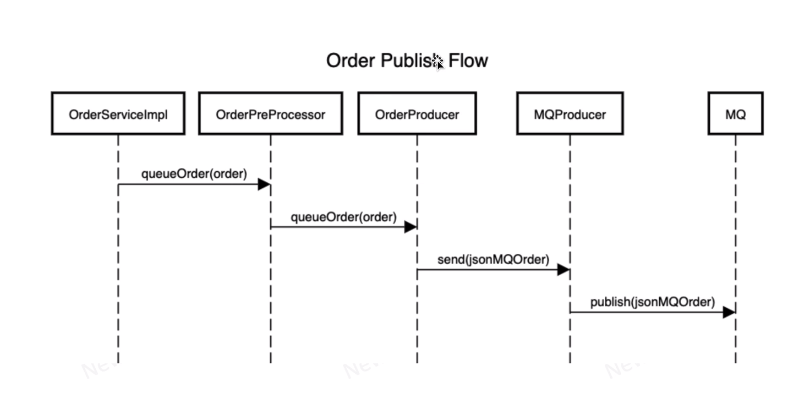
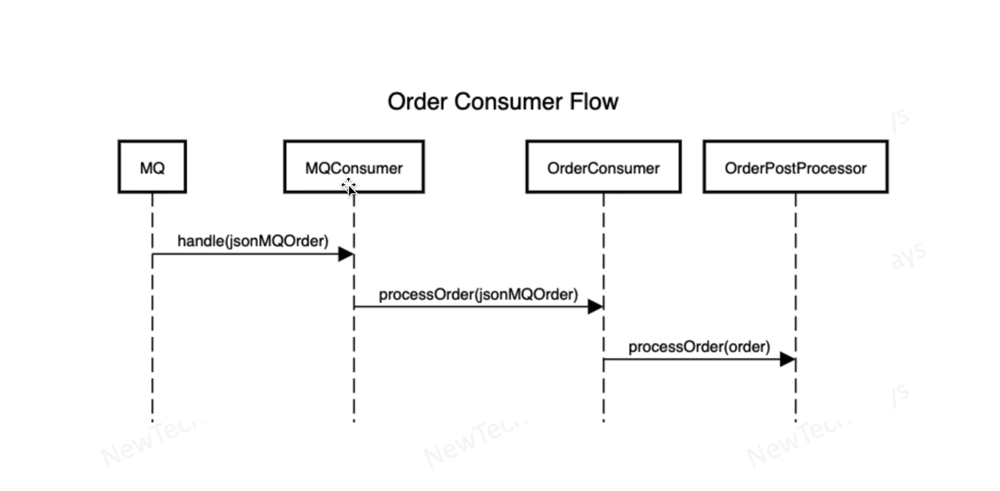

# Service Code Changes for Rabbit MQ

- new dependency - rabbitmq client in the pom

config.properties in the order service
```
order.process.async=false

order.queue.type=local
order.queue.host=localhost
order.queue.name=order-queue
```

`OrderServiceImpl.java`
```java 
        try {
            if (asyncOrderProcessing) {
                orderPreProcessor.queueOrder(order);
                logger.info("Queued order for processing; context={}", order);
            } else {
                orderPostProcessor.processOrder(order);
                logger.info("Processed order; context={}", order);
            }
        } catch (Exception e) {
            logger.error("Unable to publish order {} due to an exception: ", order, e);
        }

```
## Publisher flow


## Consumer flow
