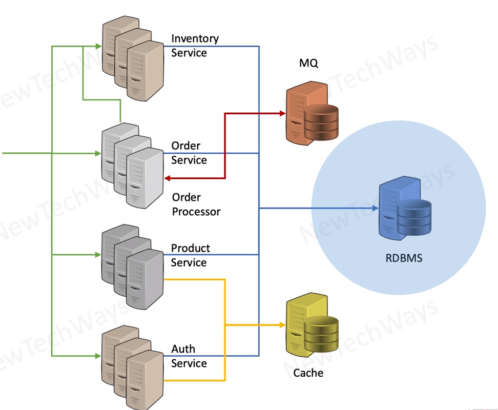
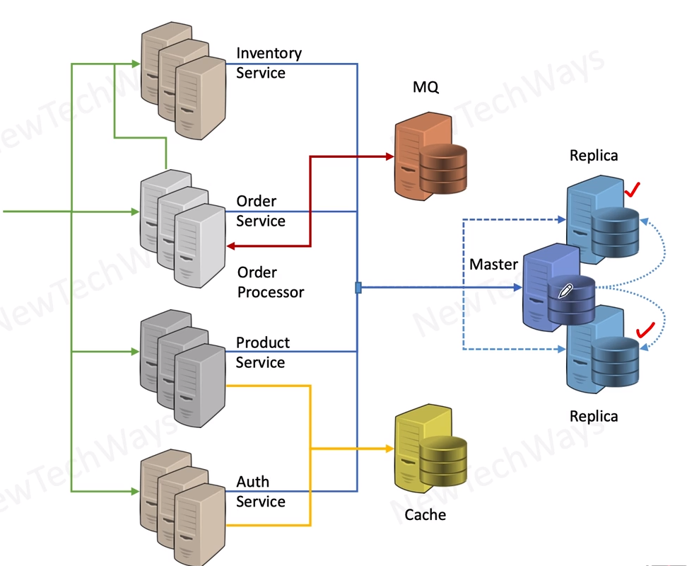
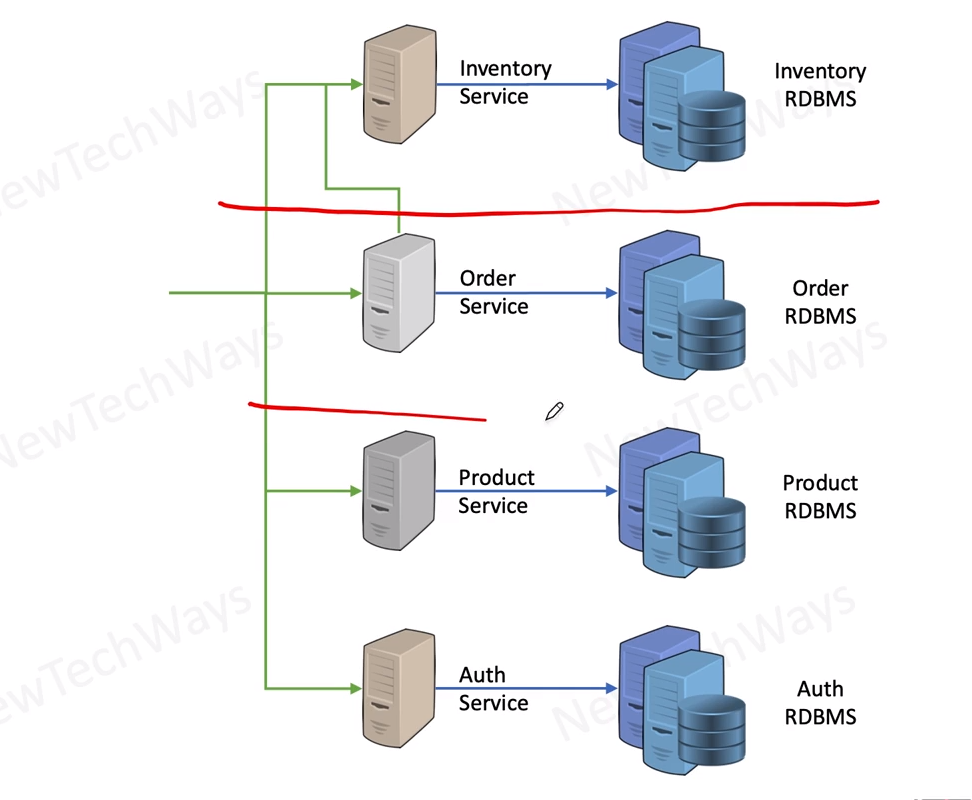
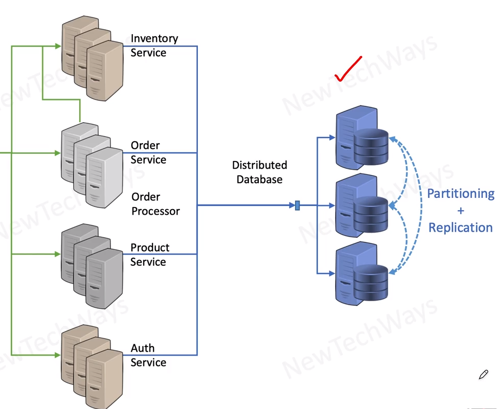
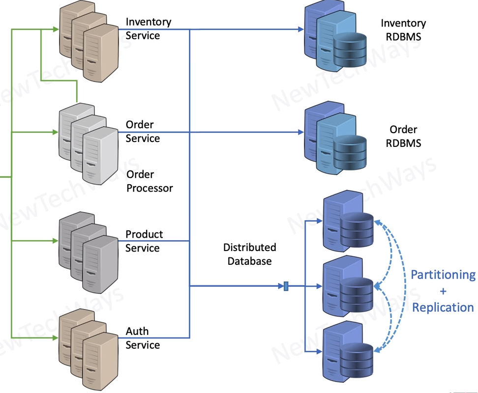

# RDBMS Limitations

- RDBMS limitations:
    - single instance
    - < 1~5 TB of data

## Partitioning Data Load
- Replication
  - high read load
    - eventually consistent read queries
  - high availability
  - write load is still a problem

## vertical partitioning - application level - micro services

- Vertical partitioning
  - microservices architecture
    - independent development and deployment
  - within a database
    - acis, joins, constraints
  - across databases
    - no integrity constraints
    - no query joins
    - no acid transactions
  - complexity of maintaining multiple databases

## Partitioning - DB Record Level

- Data Partitioning 
  - record level
- data replication
- routing request to serving instances
- schema on demand
- limited indexing
  - puts limit on query patterns

## Hybrid Approach

- RDBMS 
  - for services that need strong consistency
- Distributed database
  - for services that can be eventually consistent

