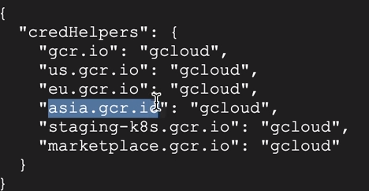
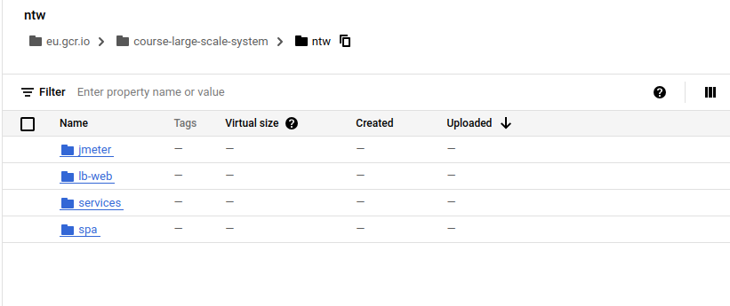

# Setting up Cloud Container Registry

- build images
- create artifact registry
- we authorizxed docker on the machine level

```bash
echo "-- Authorize Docker for Google Docker Registry --"
gcloud auth login
gcloud auth configure-docker -q

echo "-- Enable Google Container Registry service --"
gcloud services enable containerregistry.googleapis.com

```



```bash
#!/bin/bash

#REGISTRY_HOST=eu.gcr.io
#REVISION_ID=latest

if [ -z "${REVISION_ID}" ]; then
    REVISION_ID=latest
    echo "Image revision id set to: ${REVISION_ID}"
fi

if [ -z "${REGISTRY_HOST}" ]; then
    REGISTRY_HOST="asia.gcr.io"
    echo "Image Registry Host set to: ${REGISTRY_HOST}"
fi

PROJECT_NAME=$(gcloud config get-value project)
REGISTRY_PATH="${REGISTRY_HOST}/${PROJECT_NAME}"

function tag_and_push {

    echo "Tag image $1"
    docker tag $1 ${REGISTRY_PATH}/$1:${REVISION_ID}
    if [ $? != 0 ]; then
        echo "Tag image failed - $1"
        exit -1;
    fi

    echo "Push image $1"
    docker push ${REGISTRY_PATH}/$1:${REVISION_ID}
    if [ $? != 0 ]; then
        echo "Push image failed - $1"
        exit -1;
    fi

}

for image in $(docker images --format={{.Repository}} | grep "^ntw")
do
    tag_and_push $image
done

echo "-- Done --"
```

