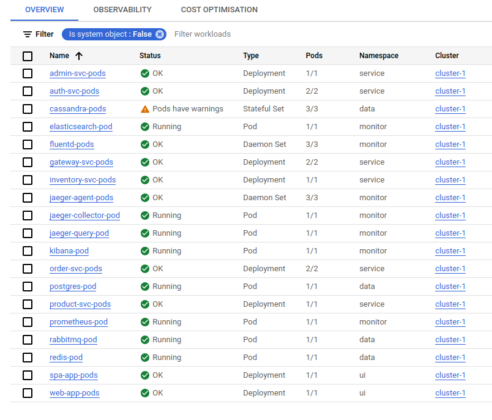

# Deploying system on Kubernetes


## Persistent volumes
```yaml
---
apiVersion: v1
kind: PersistentVolume
metadata:
  name: disk-volume-NODEIX
spec:
  capacity:
    storage: 5Gi
  volumeMode: Filesystem
  accessModes:
    - ReadWriteOnce
  persistentVolumeReclaimPolicy: Delete
  local:
    path: /mnt/local-storage
  nodeAffinity:
    required:
      nodeSelectorTerms:
        - matchExpressions:
          - key: kubernetes.io/hostname
            operator: In
            values:
              - NODENAME

```

./kube-deploy.sh ./config/ apply





## Dependencies - are defined in the Deployments for example in the iniContainers
```yaml
    spec:
      initContainers:
      - name: wait-for-postgres
        image: postgres
        command: [ '/bin/bash','-c', 'until pg_isready -h postgres.data; do echo waiting for postgres; sleep 2; done;' ]
      - name: wait-for-cassandra
        image: cassandra
        command: [ '/bin/bash','-c', 'until echo exit | cqlsh cassandra.data; do echo waiting for cassandra; sleep 5; done;' ]
      
```

## Accessing the system from the WWW

check: LoadBalancer and NodePort