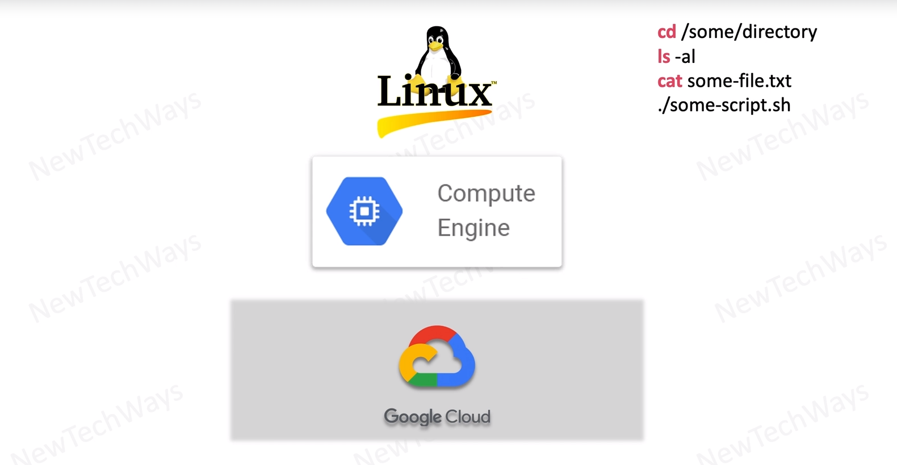

# First version of system
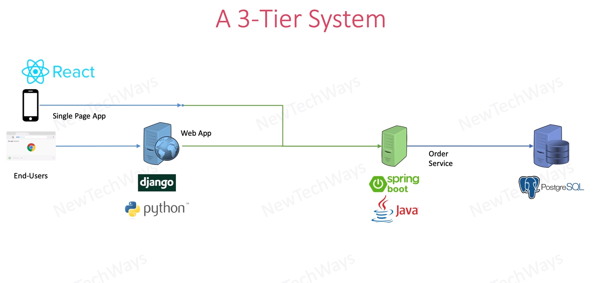

# Second Version
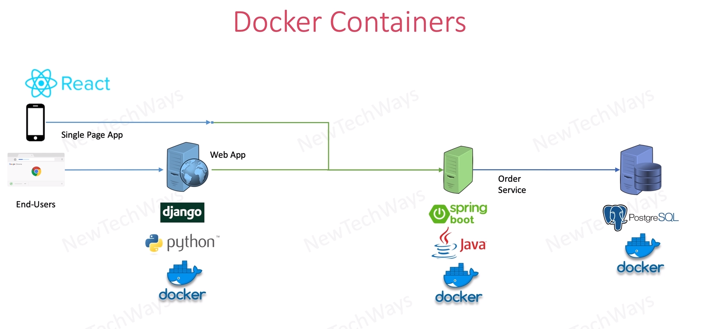

# Specialized Services - 3rd
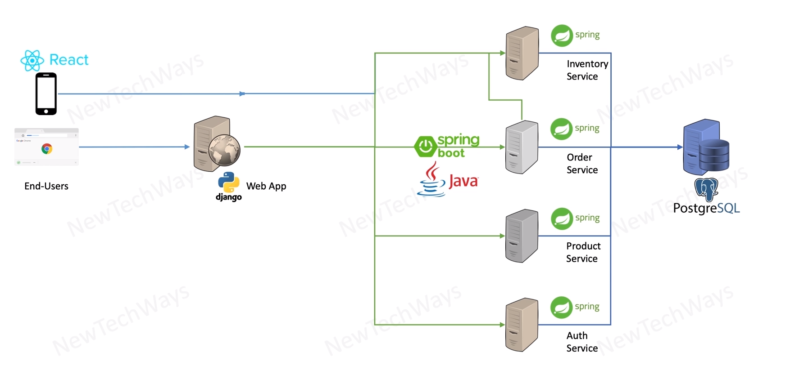

# Zuul - Gateway Service
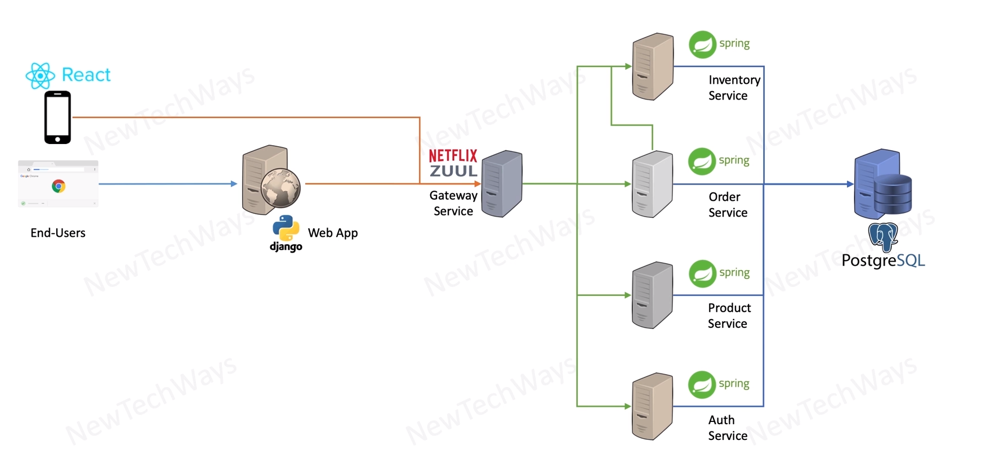

# Eureka - Discovery Services
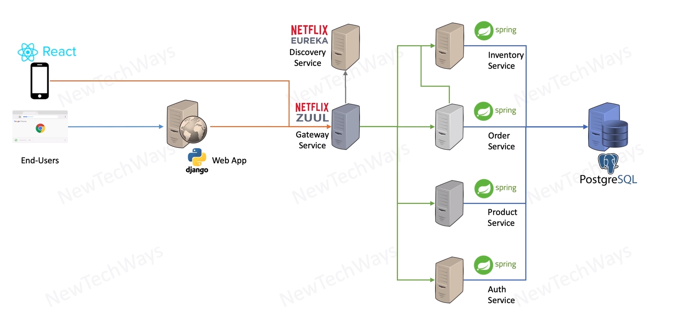

# Nginx and Ribbon - Load Balancer
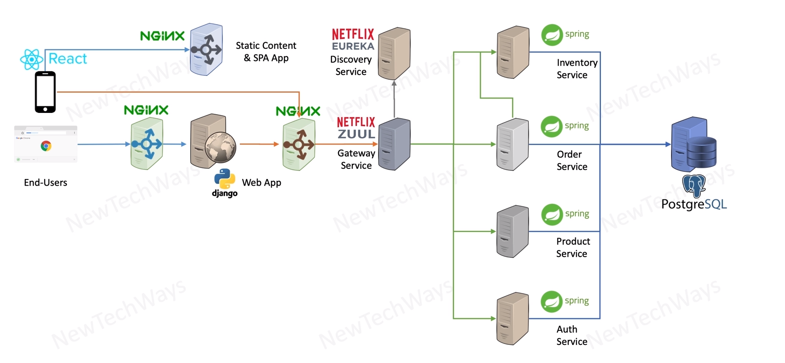

# Scale up
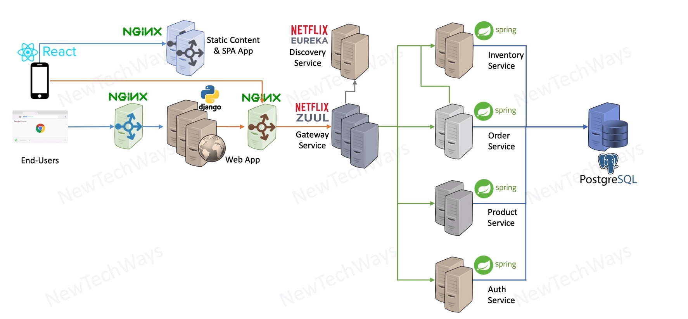

# ELK Stack - Logging
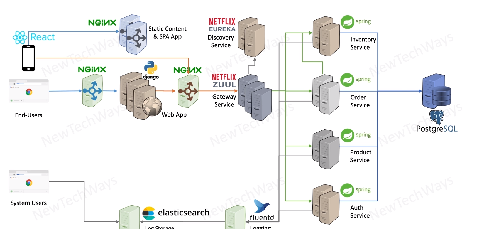

# Jaeger - Tracing
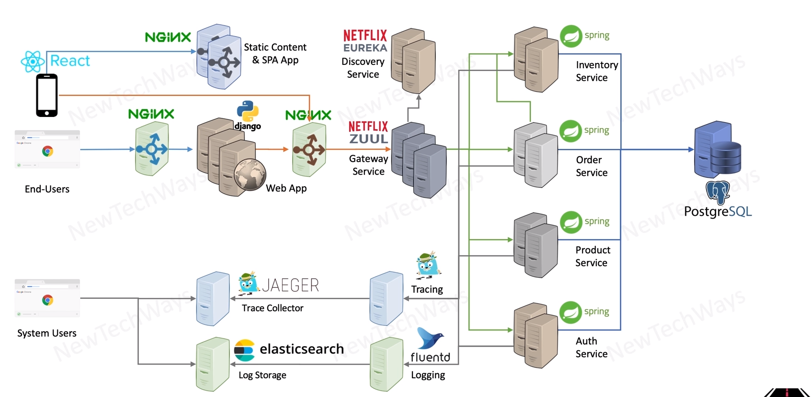

# Prometheus Metrics
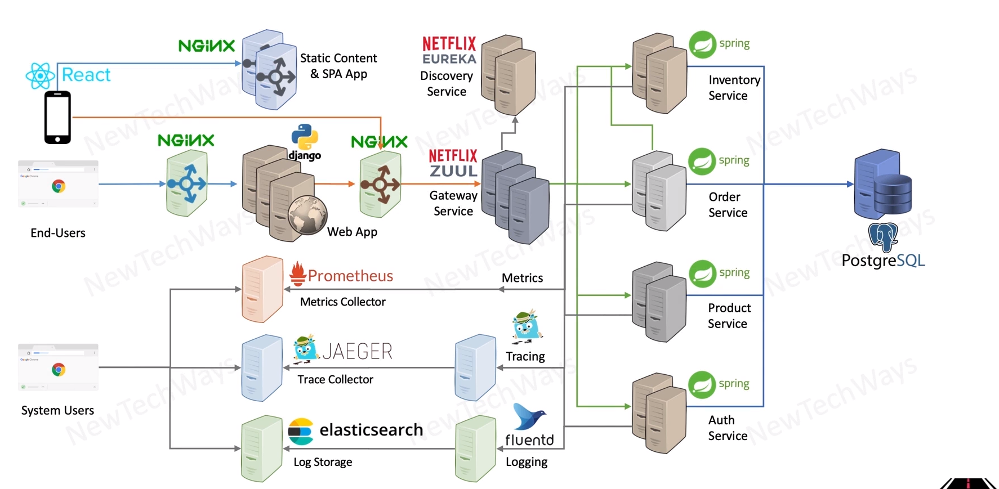

# Redis - Caching
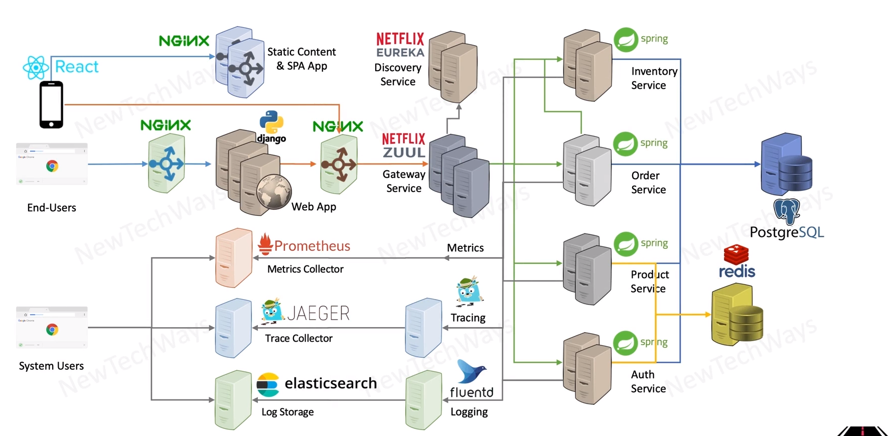

# Rabbit MQ - Async Processing
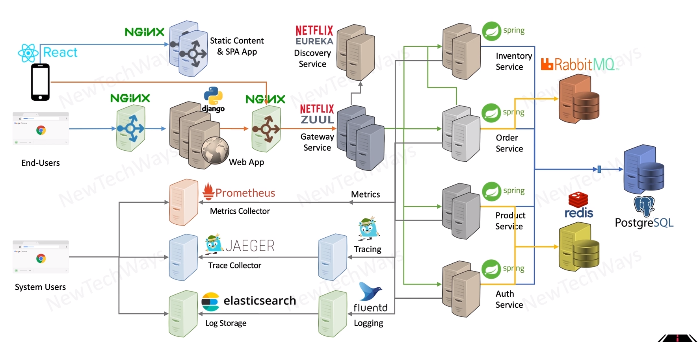

# Cassandra - Data Partitioning
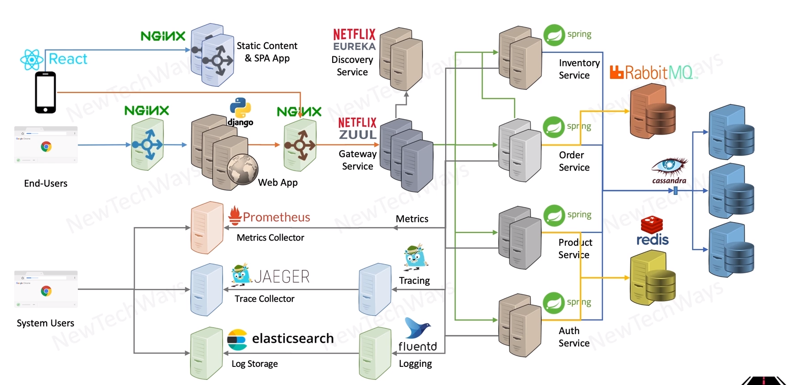

# Kubernetes - Production Deployment
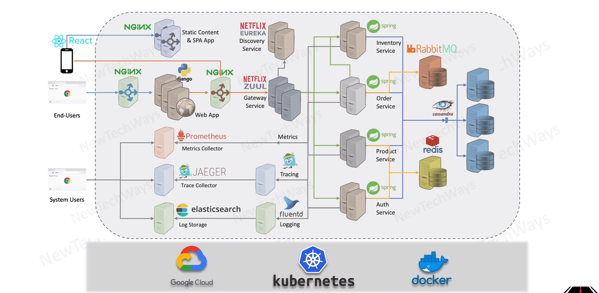

# System Evolution Process
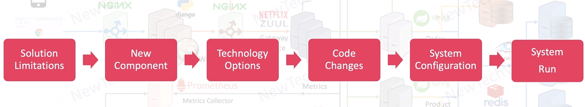

