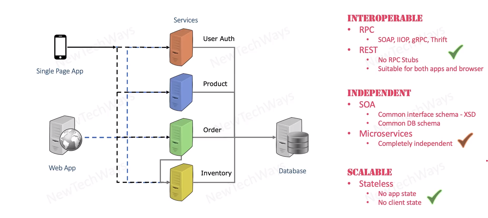

# Service Architecture

## Main three requirements:
- Interoperable
- Independent
- Scalable

considerations

- single page app  - external client
- web app - internal client
- order - inventory - between services (is item available)

--- 

A stub is a controllable replacement for an Existing Dependency (or collaborator) in the system. By using a stub, you can test your code without dealing with the dependency directly.

External Dependency - Existing Dependency:
It is an object in your system that your code under test interacts with and over 

Source: https://stackoverflow.com/questions/9777822/what-does-to-stub-mean-in-programming

- stub example - tidily coupled client and backend

---

[RPC ](https://www.geeksforgeeks.org/rpc-message-protocol/)