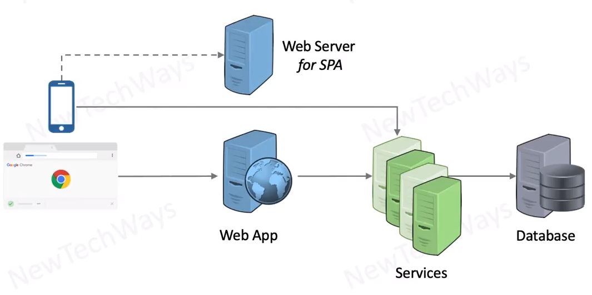

# Why Containerize application Components

- For all Environments - Dev, Test, Production
  - OS and its version needs to be consistent
  - installation of required  software with correct version
    - web - Python, Gunicorn
    - Services - Java
    - DB - Postgres
    - SPA - nginx
  - Configure Env Variables
- In production Environments
  - start instances
  - monitor liveliness
  - restart on failures

