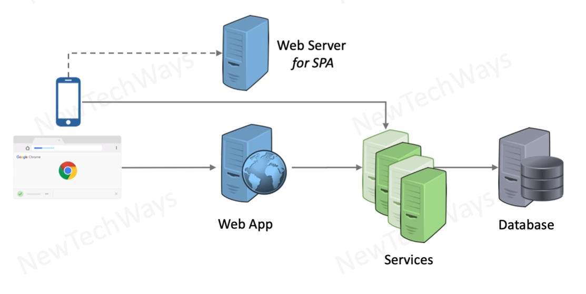

# Gains of Containerization

- For all env - dev, test, production
  - os and its versions need to be consistent
  - installation of required software with correct version
  - configure env variables
- in production environment
  - start instances
  - monitor liveliness
  - restart on failure

