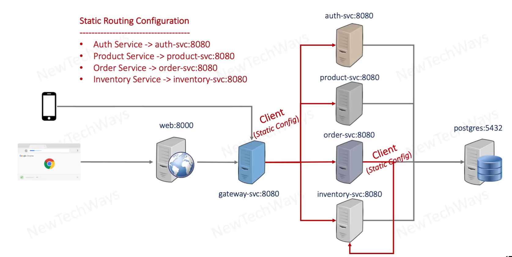
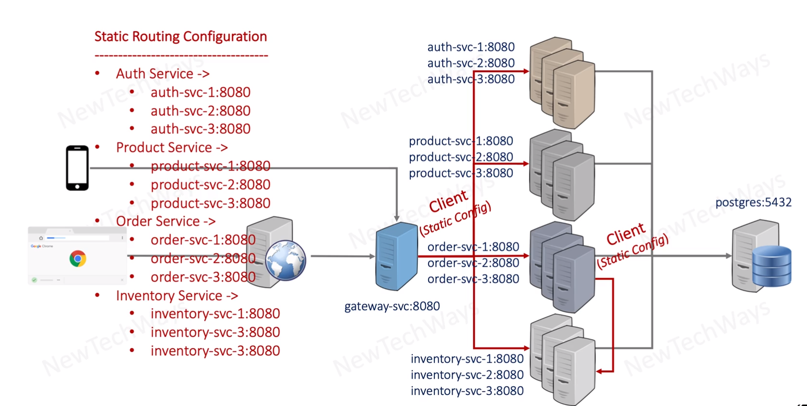
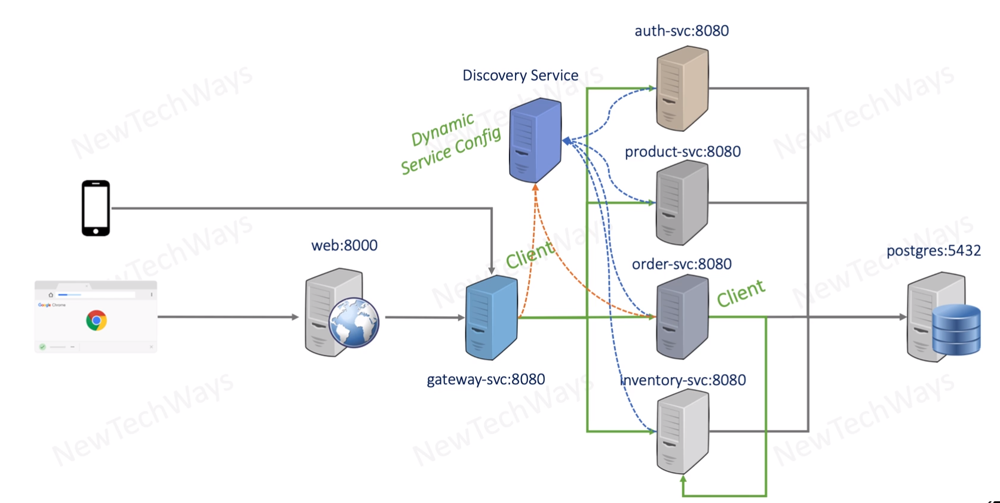
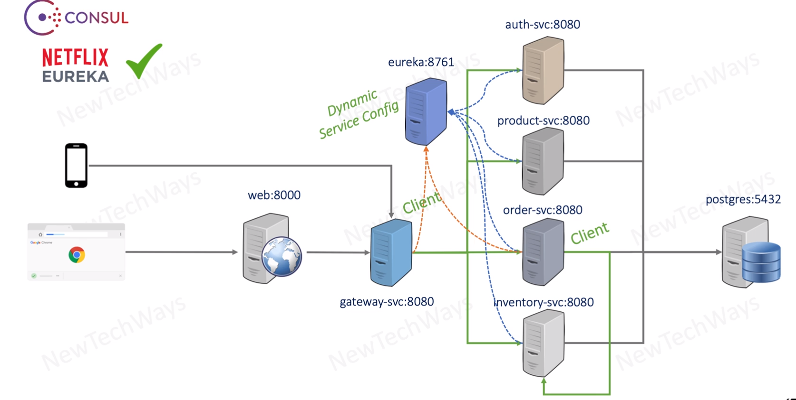

# Static Routing Challenge and Discovery Services

- simplification of the communication - client -> gateway

## What about order service -> inventory service
- how to omit static communication?
- it is called static communication configuration

## issue

## solution - Discovery Service

- provide dynamic configuration
- discovery service is updated about heart bit that server is alive

## Different options

- Consul
- Netflix Eureka (availability over consistency)
- and more....