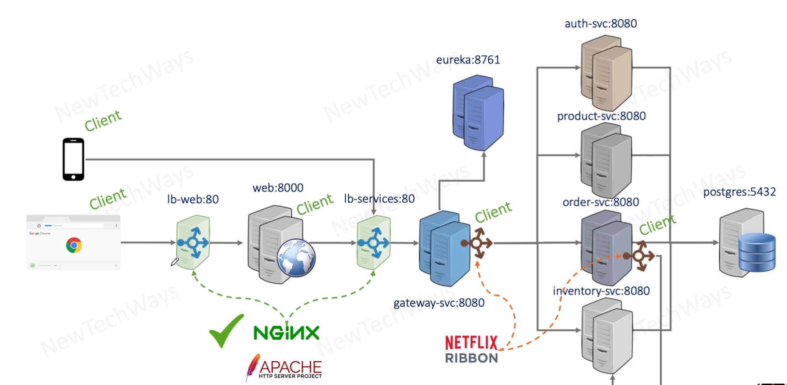

# Client based and server based load balancing

next problem:
- discovery service has all instances about the services
- all information can be fetched from there

- load balancer has to decide which instance to call

- the same for the web and mobile client 
  - to which instance they want to connect

`client-side load balancer` is aware of instances
    - no network hop
`server-side load balancer` is not aware of the instances, just call one endpoint and boom all is done
    - additional network hop

## which one to use

