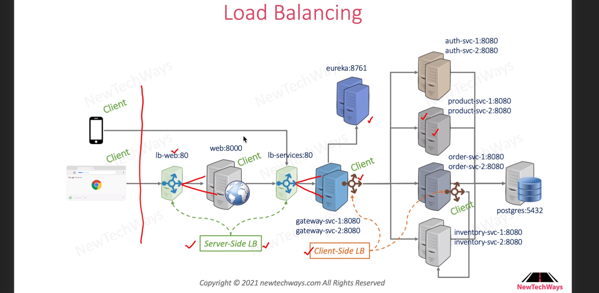

# Running System with nginx and ribbon load balancer

```Dockerfile
# Set the base image to nginx
FROM nginx:1.23

# File Author / Maintainer
MAINTAINER Anurag Yadav

# Install utility tools
RUN apt-get update
RUN apt-get install -y net-tools && \
    apt-get install -y iputils-ping && \
    apt-get install -y curl
RUN apt-get clean

# Create mount point for log files
VOLUME ["/var/log/oms"]

# Copy nging conf
COPY ./image/nginx.conf /etc/nginx/conf.d/default.conf

COPY ./image/docker-entrypoint.sh /usr/bin/docker-entrypoint.sh

EXPOSE 80

# Set default container command
ENTRYPOINT ["/usr/bin/docker-entrypoint.sh"]

```

## nginx config for load balancer

```
upstream services {
    server host:port;               <--- this is not configured correctly it should server gateway-svc-1:8080 - we are replacing it by running script >
}

server {
    listen 80;
    server_name 0.0.0.0;

    location = /favicon.ico { 
        access_log off; log_not_found off; 
    }

    location / {
        proxy_pass http://services/;
        access_log /var/log/oms/lb-services.access.log;
        error_log /var/log/oms/lb-services.error.log;
    }
}
```

the script:
```bash
#!/bin/bash

if [ -z "$SERVER_HOSTS" ]; then
    echo "SERVER_HOSTS env variable is empty. Setting it as localhost"
    SERVER_HOSTS=localhost
fi

if [ -z "$SERVER_PORT" ]; then
    echo "SERVER_PORT env variable is empty. Setting it as 8000"
    SERVER_PORT=8080
fi

IFS="," read -a servers <<< "${SERVER_HOSTS}"

echo -- Configure host port --
echo "Setting upstream servers as:"
echo "${servers[@]}"

NEWLINE=$'\\\n'

for server in ${servers[@]}
do
    if [ -z "${SERVER_CONFIG}" ]; then
        SERVER_CONFIG="   server ${server}:${SERVER_PORT};"
    else
        SERVER_CONFIG="${SERVER_CONFIG}${NEWLINE}   server ${server}:${SERVER_PORT};"
    fi
done

sed -i -e 's/.*server host:port.*/'"${SERVER_CONFIG}"'/g' /etc/nginx/conf.d/default.conf 

echo "--- Nginx Config ---"
cat /etc/nginx/conf.d/default.conf
echo "--- Nginx Config End ---"

echo -- Execute nginx --
nginx -g 'daemon off;'

```

# Load Balancer WEB


Pretty much the same (plus static content)
```Dockerfile

# Set the base image to nginx
FROM nginx:1.23

# File Author / Maintainer
MAINTAINER Anurag Yadav

# Install utility tools
RUN apt-get update
RUN apt-get install -y net-tools && \
    apt-get install -y iputils-ping && \
    apt-get install -y curl
RUN apt-get clean

# Create mount point for log files
VOLUME ["/var/log/oms"]

# Copy nging conf
COPY ./image/nginx.conf /etc/nginx/conf.d/default.conf

COPY ./image/docker-entrypoint.sh /usr/bin/docker-entrypoint.sh

EXPOSE 80

# Copy Python UI code
RUN mkdir /usr/src/PyUI
COPY ./image/PyUI.tar.gz /usr/src/PyUI

WORKDIR /usr/src/PyUI
RUN tar -zxf PyUI.tar.gz && \
    rm -f PyUI.tar.gz    

# Set default container command
ENTRYPOINT ["/usr/bin/docker-entrypoint.sh"]
```


# current deployment 

