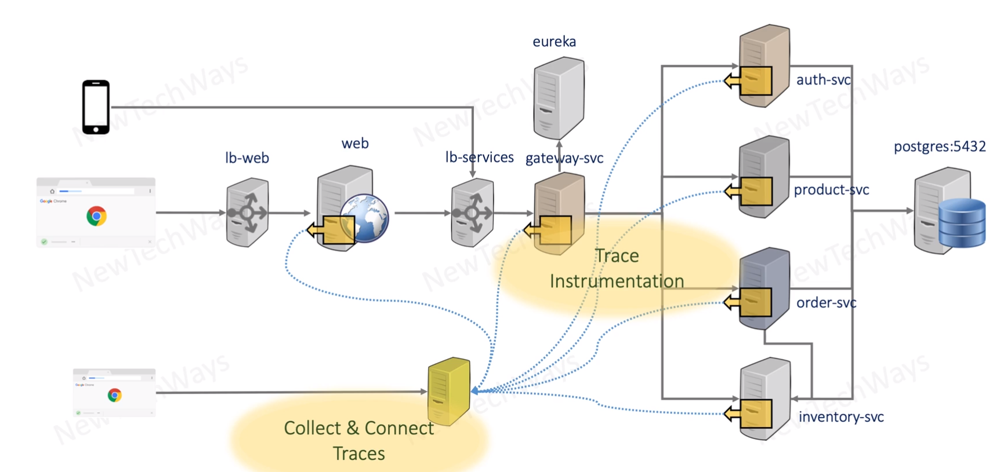
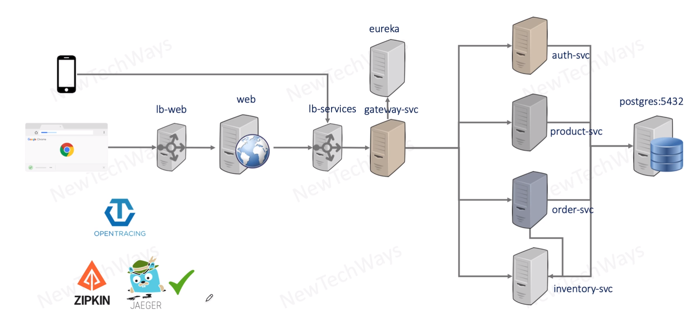

# Distributed  Tracing Architecture

- we need to introduce client libraries that is going to send trace information to centralized unit

## Products

The most popular
- ZIPKIN
- JAEGER - it is more recent and is more suitable to Jaeger (Uber project)

opentracing - is standard