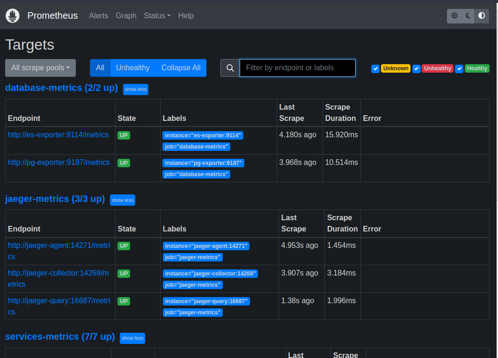
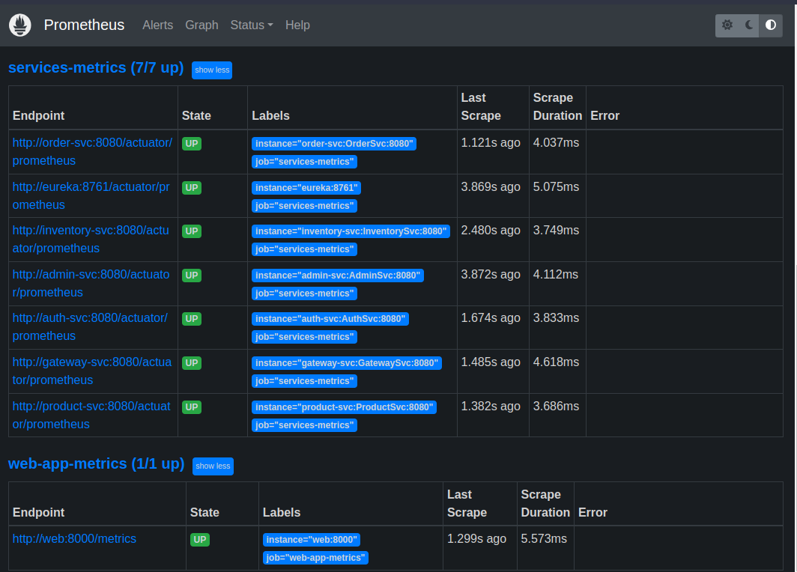
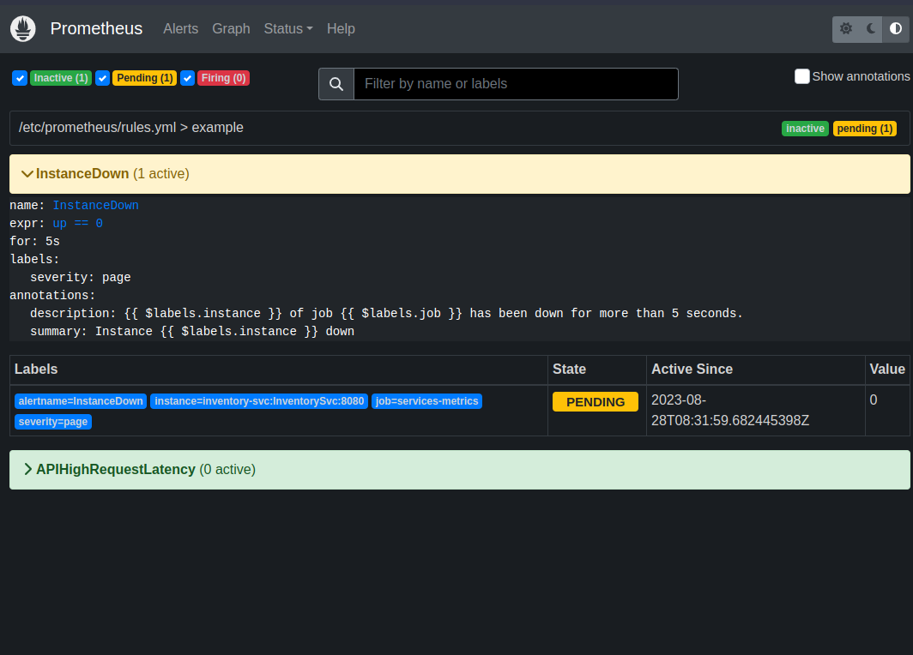
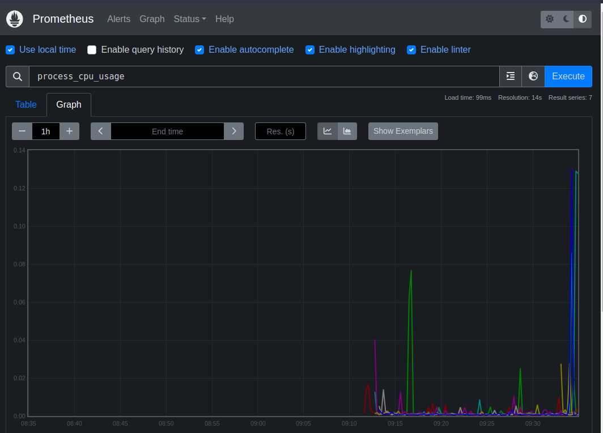

# Prometheus Configuration for Metrics






NICE





## what is picked up by prometheus
```

# HELP jvm_threads_live_threads The current number of live threads including both daemon and non-daemon threads
# TYPE jvm_threads_live_threads gauge
jvm_threads_live_threads 49.0
# HELP log4j2_events_total Number of fatal level log events
# TYPE log4j2_events_total counter
log4j2_events_total{level="warn",} 0.0
log4j2_events_total{level="debug",} 0.0
log4j2_events_total{level="error",} 0.0
log4j2_events_total{level="trace",} 0.0
log4j2_events_total{level="fatal",} 0.0
log4j2_events_total{level="info",} 20.0
# HELP jetty_threads_current The total number of threads in the pool
# TYPE jetty_threads_current gauge
jetty_threads_current 8.0
# HELP jvm_buffer_total_capacity_bytes An estimate of the total capacity of the buffers in this pool
# TYPE jvm_buffer_total_capacity_bytes gauge
jvm_buffer_total_capacity_bytes{id="mapped",} 0.0
jvm_buffer_total_capacity_bytes{id="direct",} 73728.0
# HELP jvm_gc_pause_seconds Time spent in GC pause
# TYPE jvm_gc_pause_seconds summary
jvm_gc_pause_seconds_count{action="end of minor GC",cause="Allocation Failure",} 5.0
jvm_gc_pause_seconds_sum{action="end of minor GC",cause="Allocation Failure",} 0.378
# HELP jvm_gc_pause_seconds_max Time spent in GC pause
# TYPE jvm_gc_pause_seconds_max gauge
jvm_gc_pause_seconds_max{action="end of minor GC",cause="Allocation Failure",} 0.0
# HELP jvm_gc_concurrent_phase_time_seconds Time spent in concurrent phase
# TYPE jvm_gc_concurrent_phase_time_seconds summary
jvm_gc_concurrent_phase_time_seconds_count{action="end of major GC",cause="No GC",} 1.0
jvm_gc_concurrent_phase_time_seconds_sum{action="end of major GC",cause="No GC",} 5.836
# HELP jvm_gc_concurrent_phase_time_seconds_max Time spent in concurrent phase
# TYPE jvm_gc_concurrent_phase_time_seconds_max gauge
jvm_gc_concurrent_phase_time_seconds_max{action="end of major GC",cause="No GC",} 0.0
# HELP process_uptime_seconds The uptime of the Java virtual machine
# TYPE process_uptime_seconds gauge
process_uptime_seconds 1533.678
# HELP hystrix_circuit_breaker_open  
# TYPE hystrix_circuit_breaker_open gauge
hystrix_circuit_breaker_open{group="RibbonCommand",key="AdminSvc",} 0.0
# HELP process_start_time_seconds Start time of the process since unix epoch.
# TYPE process_start_time_seconds gauge
process_start_time_seconds 1.693210229512E9
# HELP hystrix_latency_execution_seconds_max  
# TYPE hystrix_latency_execution_seconds_max gauge
hystrix_latency_execution_seconds_max{group="RibbonCommand",key="AdminSvc",} 60.07
# HELP hystrix_latency_execution_seconds  
# TYPE hystrix_latency_execution_seconds summary
hystrix_latency_execution_seconds_count{group="RibbonCommand",key="AdminSvc",} 9.0
hystrix_latency_execution_seconds_sum{group="RibbonCommand",key="AdminSvc",} 88.219
# HELP jvm_memory_used_bytes The amount of used memory
# TYPE jvm_memory_used_bytes gauge
jvm_memory_used_bytes{area="heap",id="Par Survivor Space",} 1.7377304E7
jvm_memory_used_bytes{area="nonheap",id="CodeHeap 'profiled nmethods'",} 2.5289344E7
jvm_memory_used_bytes{area="nonheap",id="Metaspace",} 6.9702824E7
jvm_memory_used_bytes{area="heap",id="Par Eden Space",} 1.78245152E8
jvm_memory_used_bytes{area="nonheap",id="CodeHeap 'non-nmethods'",} 1432960.0
jvm_memory_used_bytes{area="heap",id="CMS Old Gen",} 3.1666784E7
jvm_memory_used_bytes{area="nonheap",id="Compressed Class Space",} 8696144.0
jvm_memory_used_bytes{area="nonheap",id="CodeHeap 'non-profiled nmethods'",} 9679104.0
# HELP process_cpu_usage The "recent cpu usage" for the Java Virtual Machine process
# TYPE process_cpu_usage gauge
process_cpu_usage 0.0016038492381716118
# HELP process_files_open_files The open file descriptor count
# TYPE process_files_open_files gauge
process_files_open_files 23.0
# HELP jetty_threads_idle The number of idle threads in the pool
# TYPE jetty_threads_idle gauge
jetty_threads_idle 4.0
# HELP http_server_requests_seconds  
# TYPE http_server_requests_seconds summary
http_server_requests_seconds_count{exception="None",method="POST",outcome="SERVER_ERROR",status="504",uri="/error",} 1.0
http_server_requests_seconds_sum{exception="None",method="POST",outcome="SERVER_ERROR",status="504",uri="/error",} 60.081167772
http_server_requests_seconds_count{exception="None",method="DELETE",outcome="SUCCESS",status="200",uri="/admin/**",} 2.0
http_server_requests_seconds_sum{exception="None",method="DELETE",outcome="SUCCESS",status="200",uri="/admin/**",} 2.19593521
http_server_requests_seconds_count{exception="None",method="GET",outcome="SUCCESS",status="200",uri="/actuator/prometheus",} 282.0
http_server_requests_seconds_sum{exception="None",method="GET",outcome="SUCCESS",status="200",uri="/actuator/prometheus",} 1.593489681
http_server_requests_seconds_count{exception="None",method="POST",outcome="SUCCESS",status="200",uri="/admin/**",} 1.0
http_server_requests_seconds_sum{exception="None",method="POST",outcome="SUCCESS",status="200",uri="/admin/**",} 7.428010253
http_server_requests_seconds_count{exception="None",method="GET",outcome="SUCCESS",status="200",uri="/admin/**",} 2.0
http_server_requests_seconds_sum{exception="None",method="GET",outcome="SUCCESS",status="200",uri="/admin/**",} 0.30264646
http_server_requests_seconds_count{exception="None",method="POST",outcome="SERVER_ERROR",status="500",uri="/admin/**",} 3.0
http_server_requests_seconds_sum{exception="None",method="POST",outcome="SERVER_ERROR",status="500",uri="/admin/**",} 18.853489071
http_server_requests_seconds_count{exception="None",method="GET",outcome="SUCCESS",status="200",uri="/status",} 2.0
http_server_requests_seconds_sum{exception="None",method="GET",outcome="SUCCESS",status="200",uri="/status",} 0.036908138
# HELP http_server_requests_seconds_max  
# TYPE http_server_requests_seconds_max gauge
http_server_requests_seconds_max{exception="None",method="POST",outcome="SERVER_ERROR",status="504",uri="/error",} 60.081167772
http_server_requests_seconds_max{exception="None",method="DELETE",outcome="SUCCESS",status="200",uri="/admin/**",} 1.412122626
http_server_requests_seconds_max{exception="None",method="GET",outcome="SUCCESS",status="200",uri="/actuator/prometheus",} 0.007857395
http_server_requests_seconds_max{exception="None",method="POST",outcome="SUCCESS",status="200",uri="/admin/**",} 0.0
http_server_requests_seconds_max{exception="None",method="GET",outcome="SUCCESS",status="200",uri="/admin/**",} 0.0
http_server_requests_seconds_max{exception="None",method="POST",outcome="SERVER_ERROR",status="500",uri="/admin/**",} 7.931767988
http_server_requests_seconds_max{exception="None",method="GET",outcome="SUCCESS",status="200",uri="/status",} 0.0
# HELP jvm_threads_daemon_threads The current number of live daemon threads
# TYPE jvm_threads_daemon_threads gauge
jvm_threads_daemon_threads 38.0
# HELP hystrix_concurrent_execution_rolling_max  
# TYPE hystrix_concurrent_execution_rolling_max gauge
hystrix_concurrent_execution_rolling_max{group="RibbonCommand",key="AdminSvc",} 0.0
# HELP hystrix_threadpool_queue_current_size Current size of BlockingQueue used by the thread-pool.
# TYPE hystrix_threadpool_queue_current_size gauge
hystrix_threadpool_queue_current_size{key="RibbonCommand",} 0.0
# HELP jvm_gc_live_data_size_bytes Size of old generation memory pool after a full GC
# TYPE jvm_gc_live_data_size_bytes gauge
jvm_gc_live_data_size_bytes 2.2547472E7
# HELP jvm_gc_memory_allocated_bytes_total Incremented for an increase in the size of the young generation memory pool after one GC to before the next
# TYPE jvm_gc_memory_allocated_bytes_total counter
jvm_gc_memory_allocated_bytes_total 1.117077184E9
# HELP jetty_threads_config_max The maximum number of threads in the pool
# TYPE jetty_threads_config_max gauge
jetty_threads_config_max 200.0
# HELP process_files_max_files The maximum file descriptor count
# TYPE process_files_max_files gauge
process_files_max_files 1048576.0
# HELP hystrix_threadpool_queue_rejection_threshold_size Artificial max size at which rejections will occur even if maxQueueSize has not been reached.
# TYPE hystrix_threadpool_queue_rejection_threshold_size gauge
hystrix_threadpool_queue_rejection_threshold_size{key="RibbonCommand",} 5.0
# HELP hystrix_threadpool_threads_active_current_count The approximate number of threads that are actively executing tasks.
# TYPE hystrix_threadpool_threads_active_current_count gauge
hystrix_threadpool_threads_active_current_count{key="RibbonCommand",} 0.0
# HELP jvm_gc_max_data_size_bytes Max size of old generation memory pool
# TYPE jvm_gc_max_data_size_bytes gauge
jvm_gc_max_data_size_bytes 2.68435456E8
# HELP jetty_threads_jobs Number of jobs queued waiting for a thread
# TYPE jetty_threads_jobs gauge
jetty_threads_jobs 0.0
# HELP hystrix_threadpool_tasks_cumulative_count_total The approximate total number of tasks since the start of the application.
# TYPE hystrix_threadpool_tasks_cumulative_count_total counter
hystrix_threadpool_tasks_cumulative_count_total{key="RibbonCommand",type="completed",} 0.0
hystrix_threadpool_tasks_cumulative_count_total{key="RibbonCommand",type="scheduled",} 0.0
# HELP jvm_buffer_memory_used_bytes An estimate of the memory that the Java virtual machine is using for this buffer pool
# TYPE jvm_buffer_memory_used_bytes gauge
jvm_buffer_memory_used_bytes{id="mapped",} 0.0
jvm_buffer_memory_used_bytes{id="direct",} 73728.0
# HELP jvm_memory_max_bytes The maximum amount of memory in bytes that can be used for memory management
# TYPE jvm_memory_max_bytes gauge
jvm_memory_max_bytes{area="heap",id="Par Survivor Space",} 2.6804224E7
jvm_memory_max_bytes{area="nonheap",id="CodeHeap 'profiled nmethods'",} 1.22908672E8
jvm_memory_max_bytes{area="nonheap",id="Metaspace",} -1.0
jvm_memory_max_bytes{area="heap",id="Par Eden Space",} 2.14827008E8
jvm_memory_max_bytes{area="nonheap",id="CodeHeap 'non-nmethods'",} 5836800.0
jvm_memory_max_bytes{area="heap",id="CMS Old Gen",} 2.68435456E8
jvm_memory_max_bytes{area="nonheap",id="Compressed Class Space",} 1.073741824E9
jvm_memory_max_bytes{area="nonheap",id="CodeHeap 'non-profiled nmethods'",} 1.22912768E8
# HELP hystrix_latency_total_seconds_max  
# TYPE hystrix_latency_total_seconds_max gauge
hystrix_latency_total_seconds_max{group="RibbonCommand",key="AdminSvc",} 60.07
# HELP hystrix_latency_total_seconds  
# TYPE hystrix_latency_total_seconds summary
hystrix_latency_total_seconds_count{group="RibbonCommand",key="AdminSvc",} 9.0
hystrix_latency_total_seconds_sum{group="RibbonCommand",key="AdminSvc",} 88.224
# HELP hystrix_threadpool_threads_max_pool_current_size The maximum allowed number of threads.
# TYPE hystrix_threadpool_threads_max_pool_current_size gauge
hystrix_threadpool_threads_max_pool_current_size{key="RibbonCommand",} 10.0
# HELP ZUUL::EXCEPTION:route:RibbonRoutingFilter:500_total  
# TYPE ZUUL::EXCEPTION:route:RibbonRoutingFilter:500_total counter
ZUUL::EXCEPTION:route:RibbonRoutingFilter:500_total 1.0
# HELP jvm_threads_states_threads The current number of threads having NEW state
# TYPE jvm_threads_states_threads gauge
jvm_threads_states_threads{state="runnable",} 8.0
jvm_threads_states_threads{state="blocked",} 0.0
jvm_threads_states_threads{state="waiting",} 15.0
jvm_threads_states_threads{state="timed-waiting",} 26.0
jvm_threads_states_threads{state="new",} 0.0
jvm_threads_states_threads{state="terminated",} 0.0
# HELP hystrix_concurrent_execution_current  
# TYPE hystrix_concurrent_execution_current gauge
hystrix_concurrent_execution_current{group="RibbonCommand",key="AdminSvc",} 0.0
# HELP system_load_average_1m The sum of the number of runnable entities queued to available processors and the number of runnable entities running on the available processors averaged over a period of time
# TYPE system_load_average_1m gauge
system_load_average_1m 1.00927734375
# HELP hystrix_threadpool_queue_max_size Max size of BlockingQueue used by the thread-pool.
# TYPE hystrix_threadpool_queue_max_size gauge
hystrix_threadpool_queue_max_size{key="RibbonCommand",} -1.0
# HELP jetty_threads_busy The number of busy threads in the pool
# TYPE jetty_threads_busy gauge
jetty_threads_busy 3.0
# HELP jvm_memory_committed_bytes The amount of memory in bytes that is committed for the Java virtual machine to use
# TYPE jvm_memory_committed_bytes gauge
jvm_memory_committed_bytes{area="heap",id="Par Survivor Space",} 2.6279936E7
jvm_memory_committed_bytes{area="nonheap",id="CodeHeap 'profiled nmethods'",} 2.5296896E7
jvm_memory_committed_bytes{area="nonheap",id="Metaspace",} 7.1569408E7
jvm_memory_committed_bytes{area="heap",id="Par Eden Space",} 2.10632704E8
jvm_memory_committed_bytes{area="nonheap",id="CodeHeap 'non-nmethods'",} 2555904.0
jvm_memory_committed_bytes{area="heap",id="CMS Old Gen",} 2.63192576E8
jvm_memory_committed_bytes{area="nonheap",id="Compressed Class Space",} 9482240.0
jvm_memory_committed_bytes{area="nonheap",id="CodeHeap 'non-profiled nmethods'",} 9699328.0
# HELP jvm_threads_peak_threads The peak live thread count since the Java virtual machine started or peak was reset
# TYPE jvm_threads_peak_threads gauge
jvm_threads_peak_threads 49.0
# HELP hystrix_threadpool_threads_largest_pool_current_size The largest number of threads that have ever simultaneously been in the pool.
# TYPE hystrix_threadpool_threads_largest_pool_current_size gauge
hystrix_threadpool_threads_largest_pool_current_size{key="RibbonCommand",} 0.0
# HELP ZUUL::EXCEPTION:com_netflix_zuul_exception_ZuulException:_Hystrix_Readed_time_out:504_total  
# TYPE ZUUL::EXCEPTION:com_netflix_zuul_exception_ZuulException:_Hystrix_Readed_time_out:504_total counter
ZUUL::EXCEPTION:com_netflix_zuul_exception_ZuulException:_Hystrix_Readed_time_out:504_total 1.0
# HELP hystrix_threadpool_threads_cumulative_count_total Cumulative count of number of threads since the start of the application.
# TYPE hystrix_threadpool_threads_cumulative_count_total counter
hystrix_threadpool_threads_cumulative_count_total{key="RibbonCommand",type="executed",} 0.0
hystrix_threadpool_threads_cumulative_count_total{key="RibbonCommand",type="rejected",} 0.0
# HELP jetty_threads_config_min The minimum number of threads in the pool
# TYPE jetty_threads_config_min gauge
jetty_threads_config_min 8.0
# HELP jvm_buffer_count_buffers An estimate of the number of buffers in the pool
# TYPE jvm_buffer_count_buffers gauge
jvm_buffer_count_buffers{id="mapped",} 0.0
jvm_buffer_count_buffers{id="direct",} 6.0
# HELP jvm_classes_unloaded_classes_total The total number of classes unloaded since the Java virtual machine has started execution
# TYPE jvm_classes_unloaded_classes_total counter
jvm_classes_unloaded_classes_total 157.0
# HELP hystrix_execution_terminal_total Sum of all terminal executions. Use this to derive percentages from hystrix.execution
# TYPE hystrix_execution_terminal_total counter
hystrix_execution_terminal_total{group="RibbonCommand",key="AdminSvc",} 9.0
# HELP ZUUL::EXCEPTION:GENERAL:500_total  
# TYPE ZUUL::EXCEPTION:GENERAL:500_total counter
ZUUL::EXCEPTION:GENERAL:500_total 1.0
# HELP system_cpu_count The number of processors available to the Java virtual machine
# TYPE system_cpu_count gauge
system_cpu_count 8.0
# HELP system_cpu_usage The "recent cpu usage" for the whole system
# TYPE system_cpu_usage gauge
system_cpu_usage 0.15506471047615492
# HELP hystrix_threadpool_threads_pool_current_size The current number of threads in the pool.
# TYPE hystrix_threadpool_threads_pool_current_size gauge
hystrix_threadpool_threads_pool_current_size{key="RibbonCommand",} 0.0
# HELP jvm_classes_loaded_classes The number of classes that are currently loaded in the Java virtual machine
# TYPE jvm_classes_loaded_classes gauge
jvm_classes_loaded_classes 13852.0
# HELP hystrix_execution_total Execution results. See https://github.com/Netflix/Hystrix/wiki/Metrics-and-Monitoring#command-execution-event-types-comnetflixhystrixhystrixeventtype for type definitions
# TYPE hystrix_execution_total counter
hystrix_execution_total{event="cancelled",group="RibbonCommand",key="AdminSvc",terminal="true",} 0.0
hystrix_execution_total{event="short_circuited",group="RibbonCommand",key="AdminSvc",terminal="false",} 0.0
hystrix_execution_total{event="fallback_emit",group="RibbonCommand",key="AdminSvc",terminal="false",} 0.0
hystrix_execution_total{event="collapsed",group="RibbonCommand",key="AdminSvc",terminal="false",} 0.0
hystrix_execution_total{event="semaphore_rejected",group="RibbonCommand",key="AdminSvc",terminal="false",} 0.0
hystrix_execution_total{event="fallback_rejection",group="RibbonCommand",key="AdminSvc",terminal="true",} 0.0
hystrix_execution_total{event="thread_pool_rejected",group="RibbonCommand",key="AdminSvc",terminal="false",} 0.0
hystrix_execution_total{event="fallback_missing",group="RibbonCommand",key="AdminSvc",terminal="true",} 1.0
hystrix_execution_total{event="command_max_active",group="RibbonCommand",key="AdminSvc",terminal="false",} 0.0
hystrix_execution_total{event="timeout",group="RibbonCommand",key="AdminSvc",terminal="false",} 0.0
hystrix_execution_total{event="exception_thrown",group="RibbonCommand",key="AdminSvc",terminal="false",} 1.0
hystrix_execution_total{event="success",group="RibbonCommand",key="AdminSvc",terminal="true",} 8.0
hystrix_execution_total{event="fallback_success",group="RibbonCommand",key="AdminSvc",terminal="true",} 0.0
hystrix_execution_total{event="bad_request",group="RibbonCommand",key="AdminSvc",terminal="true",} 0.0
hystrix_execution_total{event="emit",group="RibbonCommand",key="AdminSvc",terminal="false",} 0.0
hystrix_execution_total{event="fallback_failure",group="RibbonCommand",key="AdminSvc",terminal="true",} 0.0
hystrix_execution_total{event="failure",group="RibbonCommand",key="AdminSvc",terminal="false",} 1.0
hystrix_execution_total{event="response_from_cache",group="RibbonCommand",key="AdminSvc",terminal="true",} 0.0
# HELP jvm_gc_memory_promoted_bytes_total Count of positive increases in the size of the old generation memory pool before GC to after GC
# TYPE jvm_gc_memory_promoted_bytes_total counter
jvm_gc_memory_promoted_bytes_total 9119312.0
# HELP hystrix_threadpool_threads_core_pool_current_size The core number of threads.
# TYPE hystrix_threadpool_threads_core_pool_current_size gauge
hystrix_threadpool_threads_core_pool_current_size{key="RibbonCommand",} 10.0

```