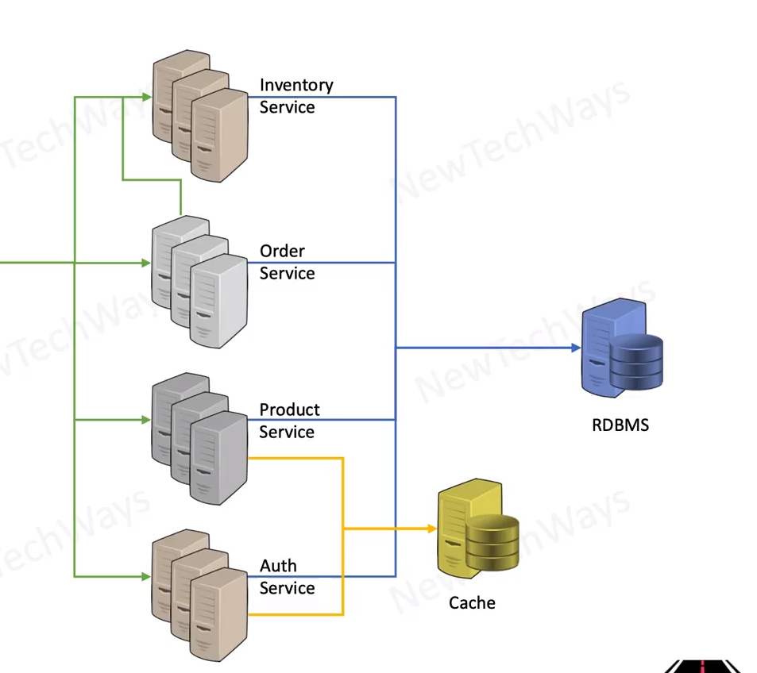

# Caching for Managing read only load

## Reduces data read load from the backend
  - improve performance of read requests
  - creates more capacity for write requests

## challenge is to deal with stale data
  - ttl values
    - not ideal for dynamic data
  - batch update
    - read origin and update cache
  - dynamic update 
    - update cache on add/update/delete
    - it is like incremental building of the cache and then keeping it updated

