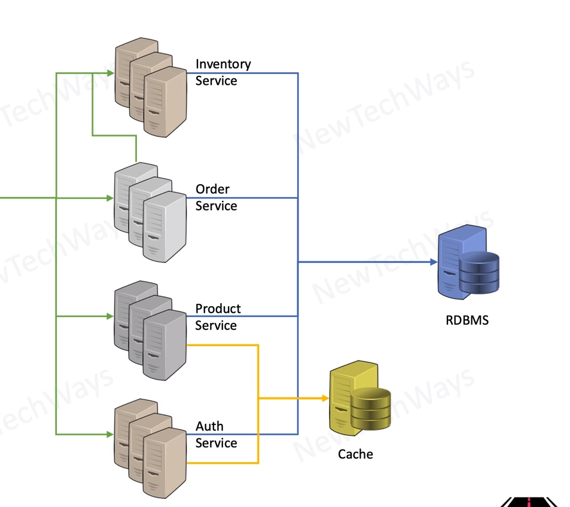

# Caching Technology Selection

## technology
- Memcached
- Redis <----- currently more popular solution now

---
- Eviction Poliocy
  - LRU/LFU/TTL
    - Dataset that cannot fir in memory
    - view a product, user
  - no eviction - like DB
    - datasets that can fit in memory
    - view all products in a category
- Cache Persistence   <--- Redis
  - no frequent cache warmup
    - restart - maintenance / failure

---

