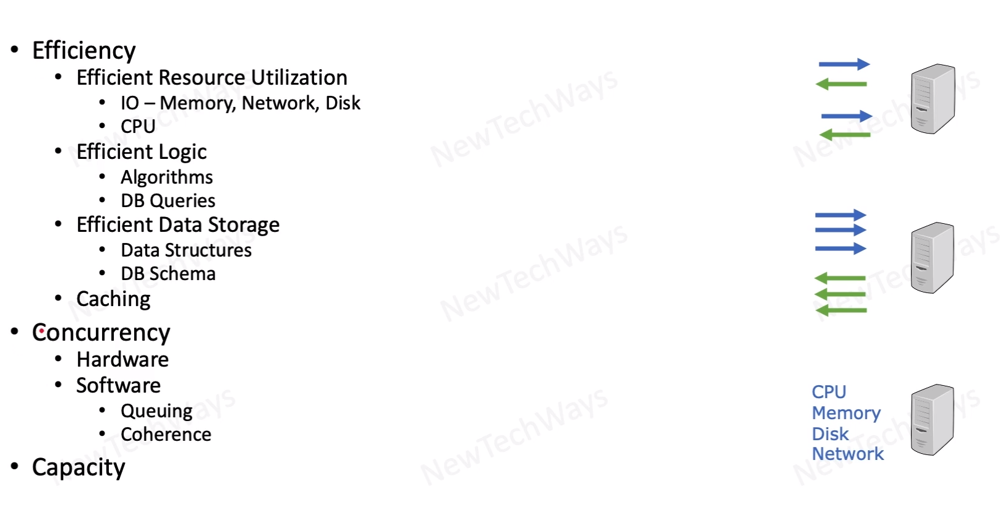

# Performance Principles

- high degree of efficiency
  - efficiency of single processing
- high degree of concurrency
- adequate capacity

Serial Request - one by one (single processing)
 
Concurrent Requests - simultaneous requests