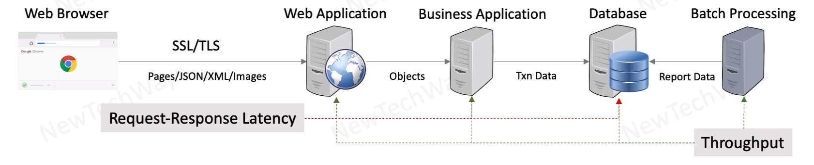

# System Performance Objectives

- Minimize Request-Response Latency
  - Latency is Measured in Time Units
  - depends on
    - wait/idle time
    - processing time

- Maximize throughput
  - throughput is measured as rate of request processing
  - depends on:
    - latency
    - capacity
  
  

  in case of `batch processing` we are only talking only about throughput

