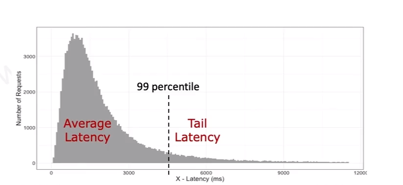

# Performance Measurement Metrics

Latency:
- affects - user experience
- desired - as low as possible

throughput
- affects - number of users that can be supported
- desired - greater than the request rate

Error 
- affects - functional correctness
- desired - none

Resource Saturation
- affects - hardware capacity required
- desired - efficient utilization of all system resources

Tail latency is an indication of queueing of requests
- get worse with higher workloads
average latency hides the effects of tail latency
- also measure 99 (or 99.99) percentile latency

