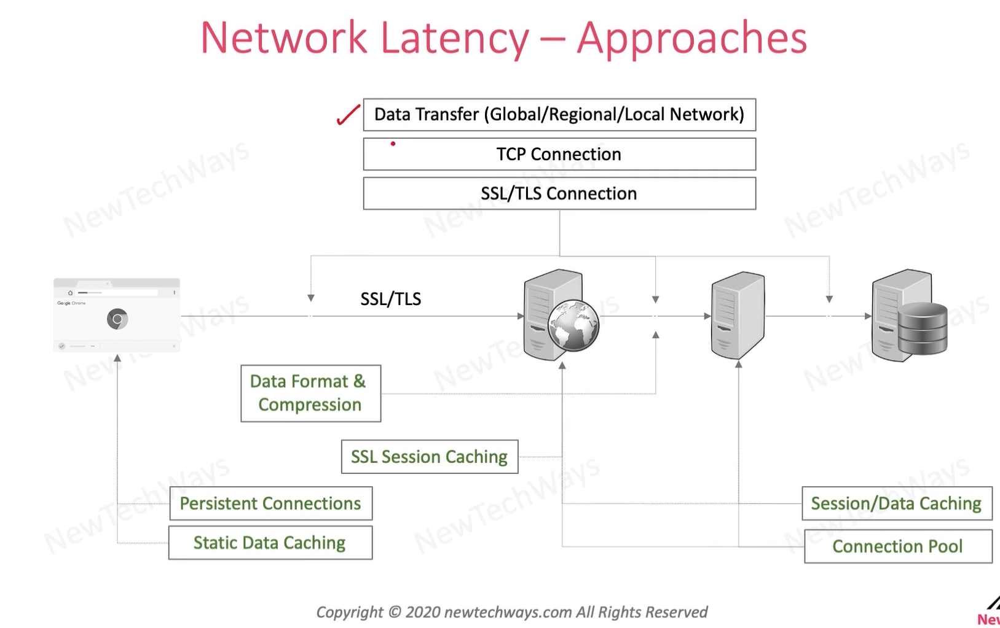

# Minimizing Network Transfer Latency

- persistent connection - browser can keep connection live

## Data Transfer 
- reduction of data size - data format and compression
- avoiding transfer - cache the data

- ssl session caching - data related to encryption etc
  - used to identification 
  - you are saving round trips present in the connection creation