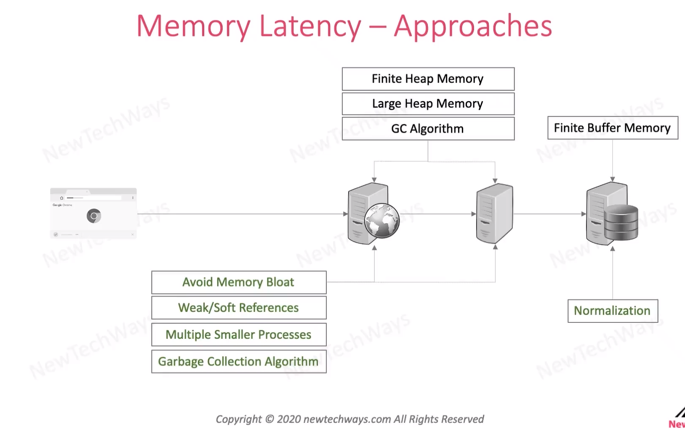
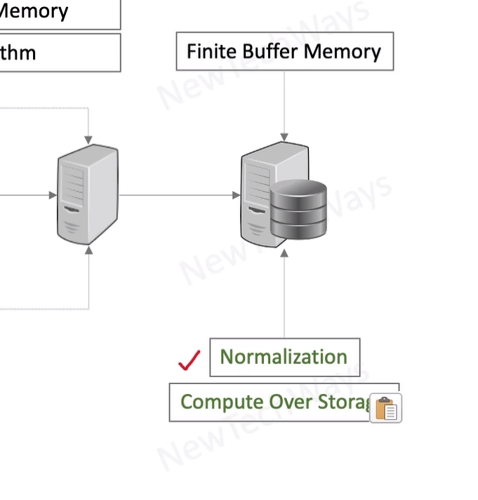

# Minimizing Memory Access Latency

- Avoid Memory Bloat - small process that use little memory
  - smaller code base
  - less job for GC algorithm
- Weak/soft references 
  - easier to remove from the memory
- Garbage Collection Algorithm
  - there are different type of algorithm
  - run with app and doing some GC
  - stop process and do some GC
    - (pause step)

- Normalization 
  - avoid duplicated data
  - save the buffer memory and minimize the size of db
- compute over storage
  - is putting weight on processor to calculate some data that is not stored in db directly

