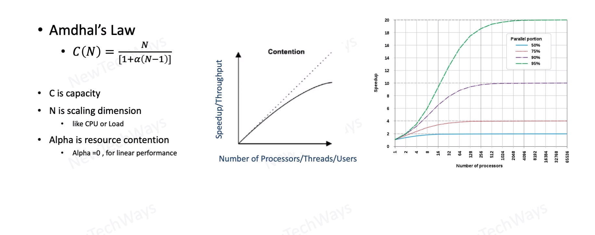
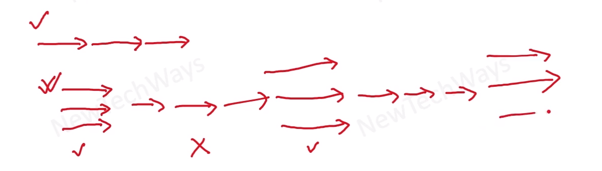

# Amdahl's Law for concurrent tasks

parallel -> serial -> parallel

this mix is realistic, because we are going to have serial processes as well. for example I/O of the logs

## This Algorithm answering question of: 
How the `serial` part affect the `parallelization` of the process