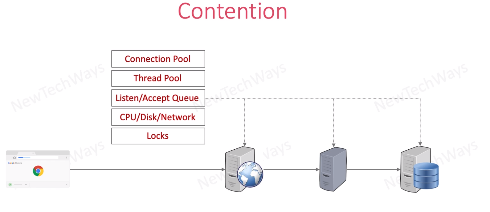

# Shared Resource Contention

1. A contention is a conflict when two or more programs try to use the same resource or setting at the same time.

2. When referring to a network, a contention is when two or more computers try to access the same file at the same time.

3. With wireless networking, a contention is when two or more data stations attempt to transmit at the same time over a shared channel.