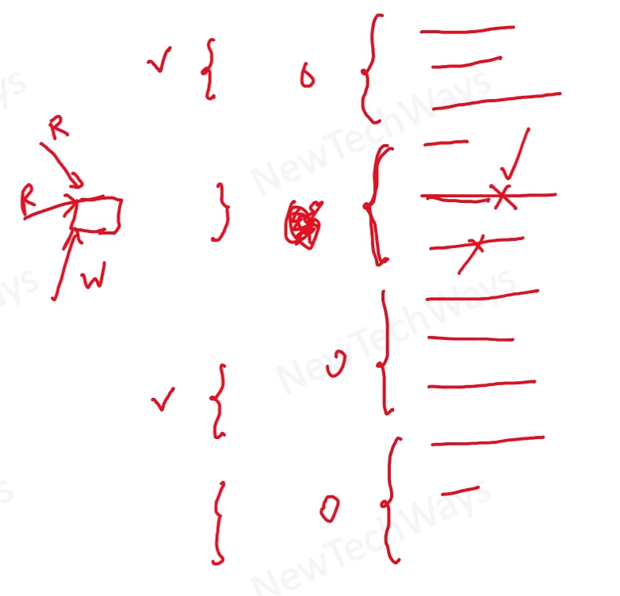

# Minimize Lock Contention - it is more related to the programming

- Reduce the duration for which a lock is held
  - move out the code, out of synchronization block, that does not require a lock (aspecially an IO)
  - lock splitting - split lock into lower granularity locks that are experiencing moderate contention
  - lock striping - split locks for each partition of data like in Concurrent HashMap

- Replace exclusive locks with coordination mechanism 
  - use ReadWriteLock/Stamped Locks
  - use atomic variables (protected by CAS)

Locking Examples 'code'