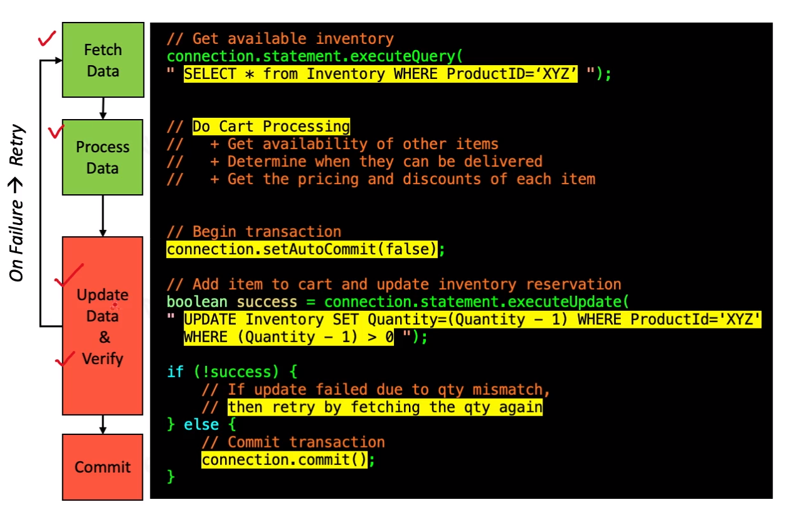

# Optimistic Locking
- threads do not wait for a lock
- threads backup when they discover contention
- use when contention is between low and moderate
- may result in starvation
  - switch to pessimistic locking

