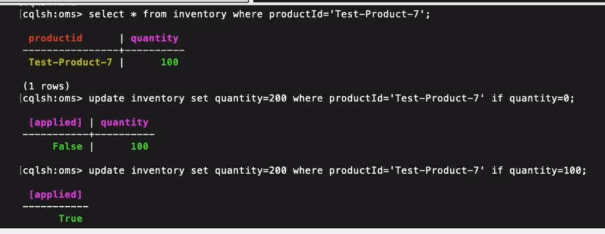
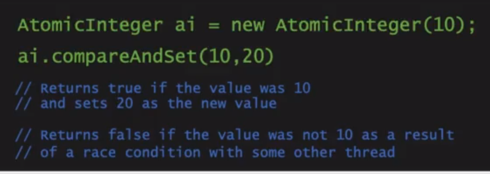

# Compare and Swap - mechanism used in optimistic locking - implementation
- CAS is an optimistic locking mechanism
-  all modern hardware (CPU) support it
-  Java Implements support of CAS thorough Atomic (java.util.concurrent.atomic.*) classes

Optimistic Locking
