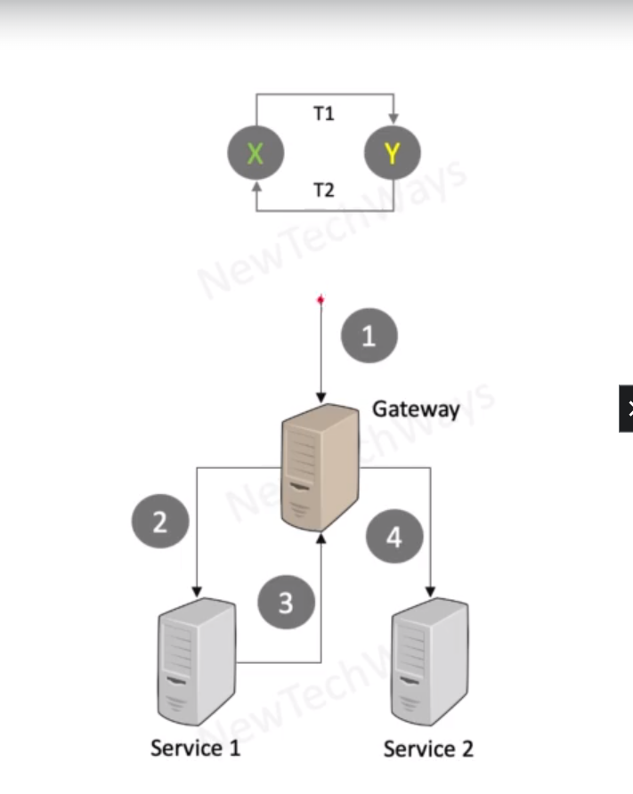

# Deadlocks

- Lock Ordering Related
  - Result of threads trying to acquire multiple lock
    - Simultaneous money transfer from X and Y accounts by thread T1 and T2
    - T1: from X to Y
    - T2: from Y to X
  - Acquire locks in a fixed global order
    - acquire locks only in the sort order of account numbers: X and they Y

- Request Load Related
  - Threads waiting for connections to multiple databases
    - may run out of enough connections resulting in deadlocks
  - Threads waiting for other threads to be spawned and perform some work
    - may run out of enough threads resulting in deadlocks

