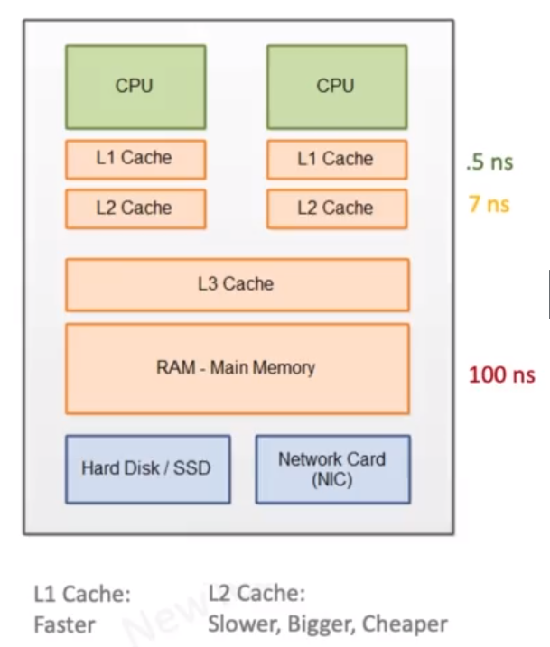

# Coherence Delays

- Visibility (Volatile)
  - Java guarantees that a volatile object is always read from main memory and written back to main memory when updated in a processor

- Locking (synchronized)
  - all variables accessed inside a sync block are read from the main memory at the start of the sync block
  - all variables modified in a sync block are flushed to the main memory when the associated thread exists the sync block 

    Synchronized ensures locking & visibility.
    Volatile only ensures visibility

- These guarantees are provided using memory barriers which may result in invalidating or flushing caches

