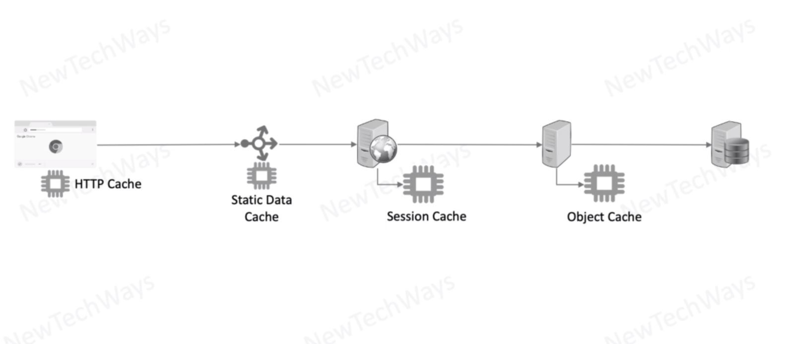

# Caching

Different points where we can use caching

- `object cache` - not specific to use - general
- `session cache` - mostly of user level - anything related to user
- `static data cache` - images, css files, js or even html
  - CDN or any other public cache
- `HTTP Cache` - users browser

In general we can divide this cached data for `static` and `dynamic`