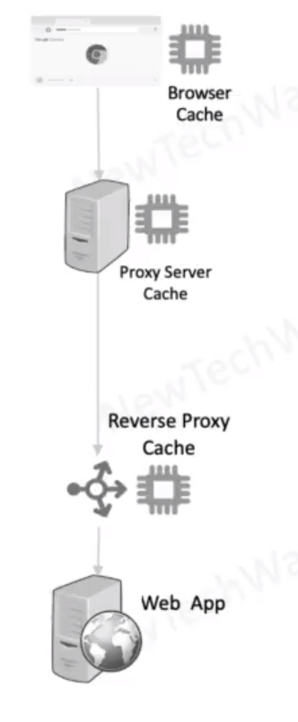

# HTTP Caching for Static Data

- GET method responses are idempotent and hence good candidates for caching 
- Headers
  - `Cache-control`: If a resource can be cached
    - `No-cache`: do not use cache without validating with origin server.
    - `Must-revalidate`: Like no-cache but need to validate only after its max-age (even if client is ready to accept stale date)
    - `No-store`: Do not cache at all
    - `Public`: Any shared cache can cache
    - `Private`: Only a client cache can cache
    - `Max-age`: Maximum age of a resource in cache, relative to resource request time
  - `ETAG`: a hash code for indicating version of a resource
    - Invalidates previous version cache

