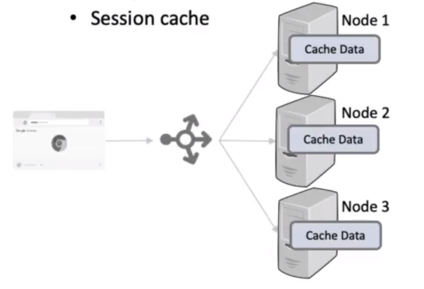
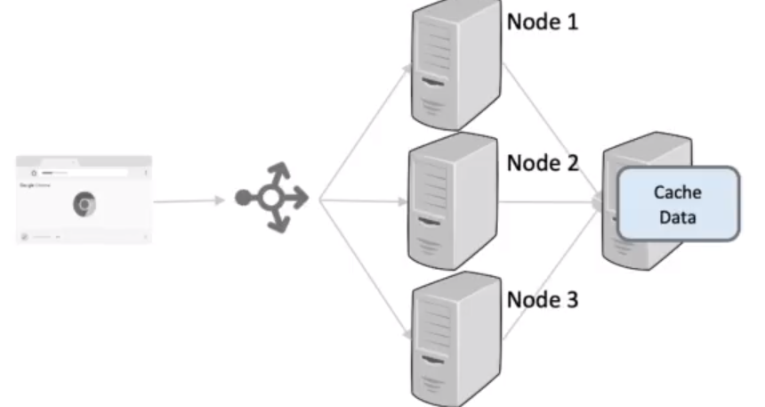

# Caching Dynamic Data

- Exclusive
  - has low latency
  - without routing can lead to duplication
    - useful for smaller datasets
  - without routing can lead to uneven load balancing
    - session cache

- Shared Cache 
  - Higher latency due to an extra hop
  - Can scale out to a distributed cache
    - Memcache 
    - Redis
  - For large datasets

