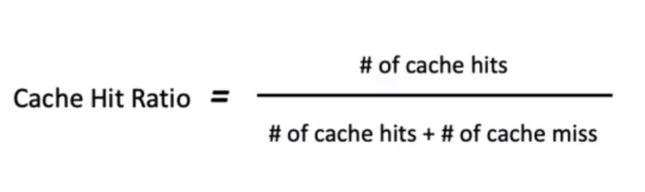

# Caching Challenges

- Limited cache space results in early evictions
  - prefer caching for frequently accessed objects
    - Cache fast-moving consumer goods vs slow moving goods
  - Average size of cached objects should be as small as possible
    - large sized objects results in cache getting full to soon causing evictions

- Cache Invalidation & Cache Inconsistency 
  - Requires Update/Deletion of Cached value upon update
    - Not an option when a cache is outside of a system
    - no cache inconsistency
  - TTL value can be used to remove aged data
    - `High TTL` results in more cache hits
      - Inconsistency interval increases
    - `Low TTL` decreases inconsistency interval
      - Cache hits go down