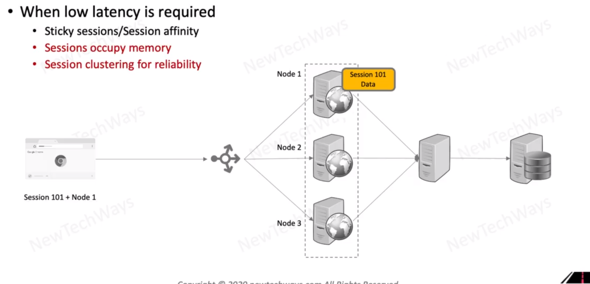
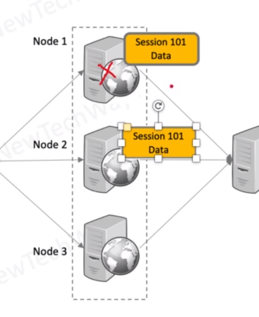

# Web Stateful Replication

- the challenge is to point user to the same server where is cached data 
  - sticky session
  - info is stored in cookies

- you need to deploy more machines - if you want to server to the same number of users
  - memory limitation vs cache

- problem with upcoming cookies to node 1 when the node 1 crashed
  - without any options it would route to other nodes and we will encounter latency
  - because we lost cached data by values stored in the cache

- updating user profile that is cached 
  - basically we have chance here to get stale data

We can duplicated data between the nodes but this solution is very difficult to implement
