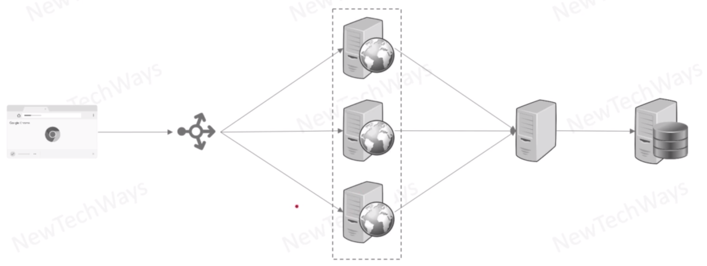
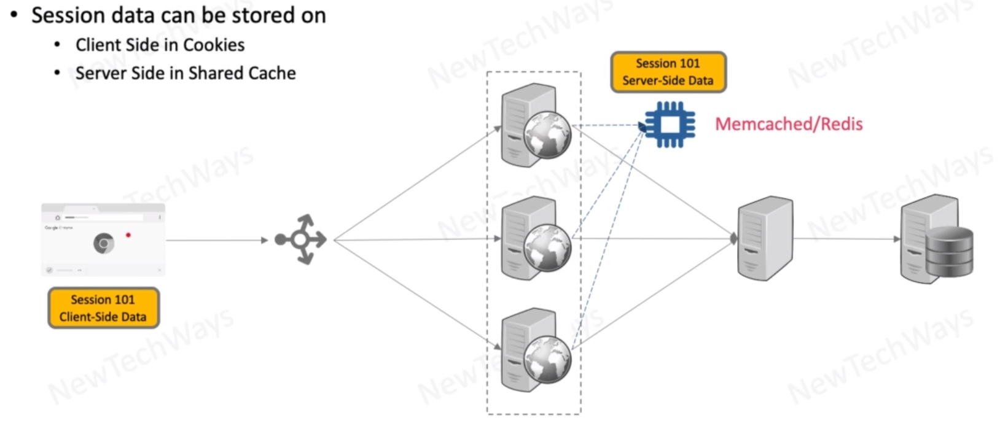

# Web Stateless Replication

- For higher scalability at the expense of higher latency

issues
- we are adding on latency - because of getting data from the DB

How to overcome the latency issue:

You can store data in the cookies to
- cookies has as well as size limitation