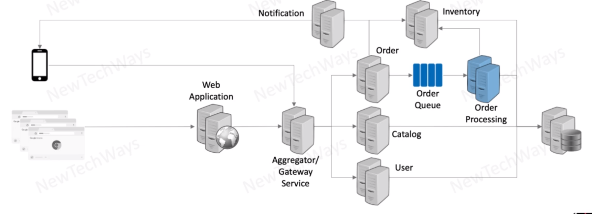

# asynchronous services
- async services effectively reduces write load from a database 

when we need read and send response best option is synchronous approach
but
when we just need to write something then we can go for async (async on this level - check image - queue)