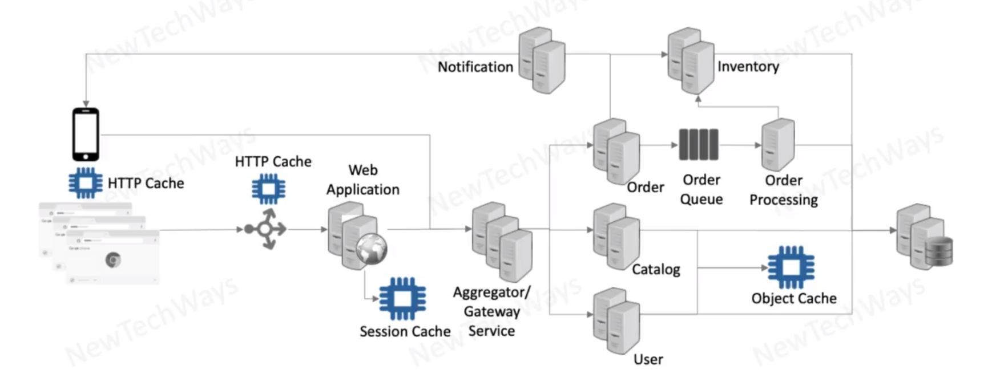

# Caching for scalability

- Caching reduces latency and reduces overall read load
- data frequently read and rarely modified 
- the problem with DB is that you can not make it stateless so using cache might be very crucial for overall performance of system

