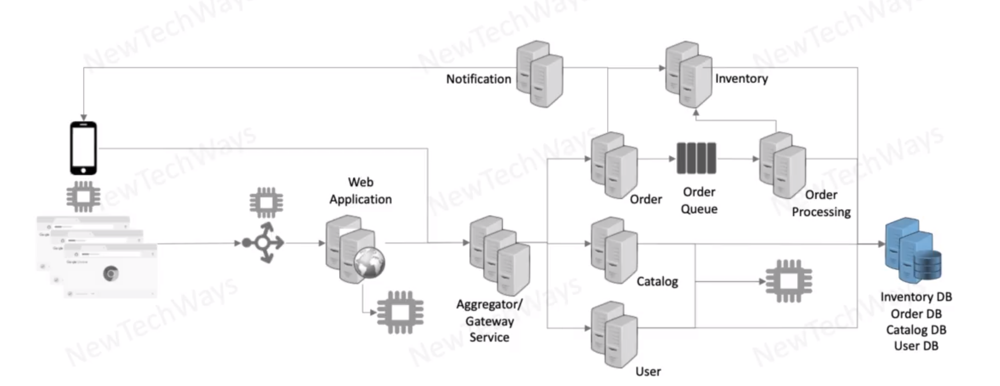
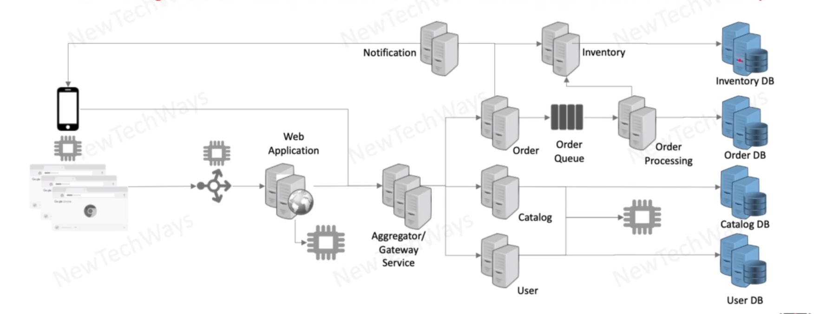

# Vertical Partitioning (Micro-Services)

- Micro-Services completely decouples services and databases for higher scalability

- asynchronous processing - `order queue` part

- to scale database we can split the database
- separate the data and by this we are making it faster and more scalable

- note:
  - can no longer do inter service ACID transactions and need to deal with eventual consistency
- data can be only accessed by the service
- data is spitted by the business logic
- db  may have different load
- it is easiest to scale in case of read and write

## `vertical partitioning of the services`
