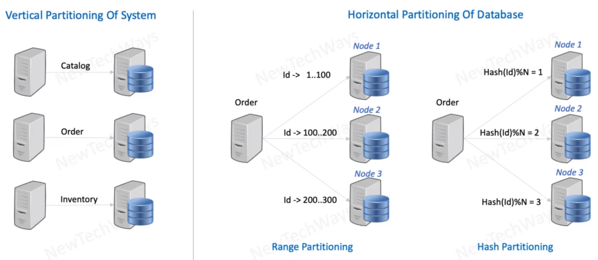

# Database Partitioning

- vertical partitioning is based on the domain and the databases are independent
- range partitioning - mostly NoSQL db
- `CONSISTENT HASHING` - IS USED IN THIS TYPE OF PARTITIONING