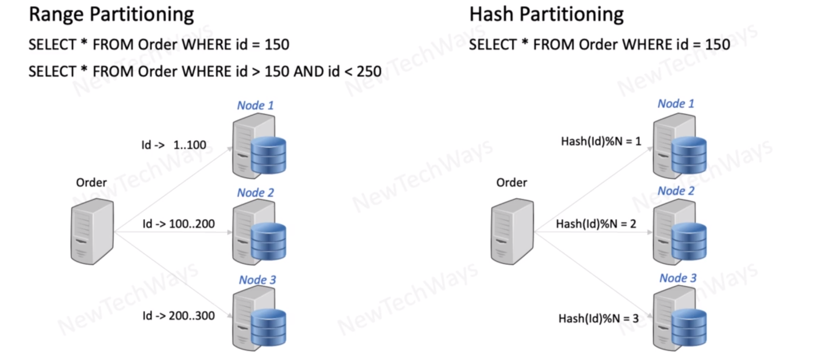
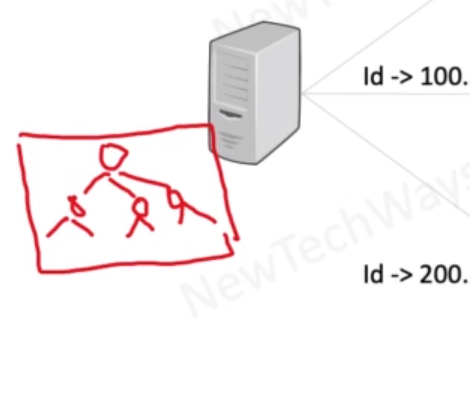

# Database Partitioning Selection

why we need hash partitioning?
- accessing by hash is faster
- by hash we can determine on which node data is stored - almost instant
- if we use regular approach we need to go through tree - that is slower

