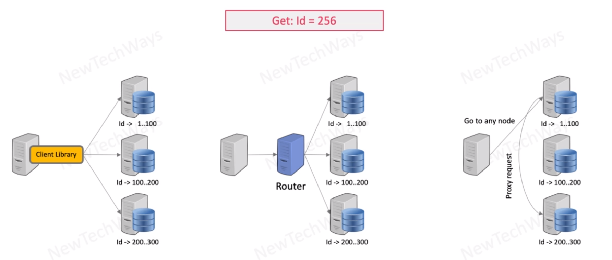

# Routing with Database partitioning

router is component of database for example in the DB
router is cluster aware

third example is based on dynamoDB or cassandra where client can ask any node and got the question where the data is located
