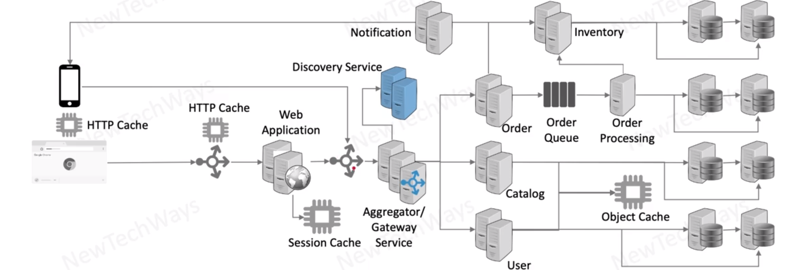
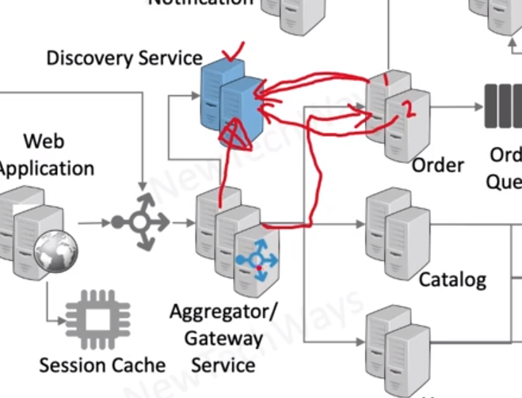
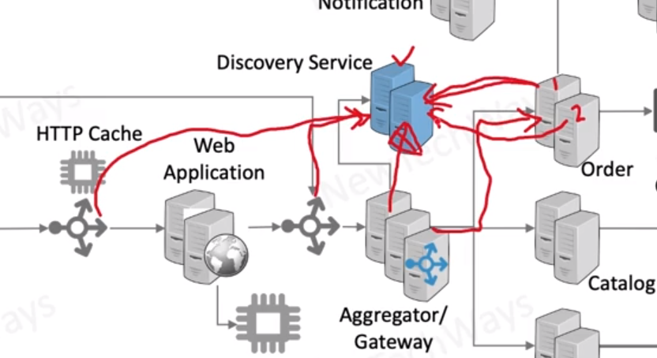

# Discovery Service and Load Balancing
- discovery - registry for IP of HEalthy Instances

new parts
- Discovery Service
  - so it will have all information about services and running services
  - instances as well update about heartbeats of the instances
- Aggregator / Gateway Service
  - this is query discovery service and getting information what is ALIVE
  - it will use of strategy and choose the instance that it want to call
  - based on the load balancing strategy

- if `order service` want to call `user service` it is going to call aggregator and check what it can call (`internal communication`)

## !Important
This is alternative to traditional load balancing - interesting

Traditional load balancer can call discovery services too and get this information's
