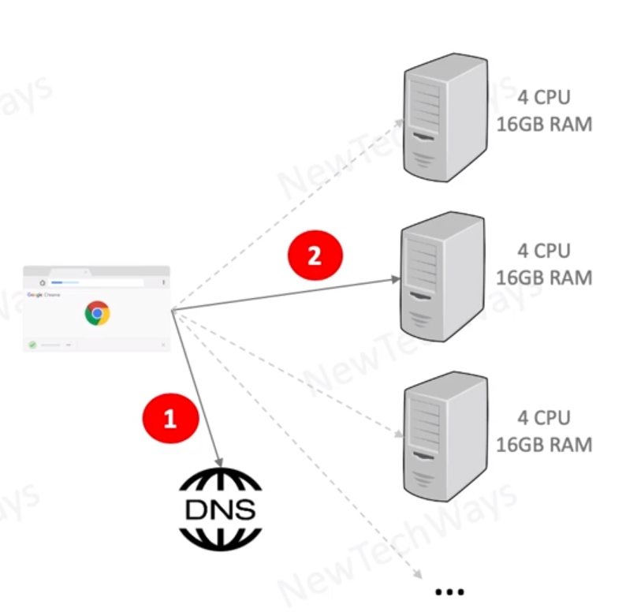

# DNS as a Load Balancer

- Configure DNS record with multiple A records
  - return single IP in a round robin fashion
  - return a list of IP
- Cloud based DNS can be configured along with health checks
- Drawbacks
  - Indefinite caching and not respecting TTLs
  - low or zero TTLs can create a very high load on DNS

