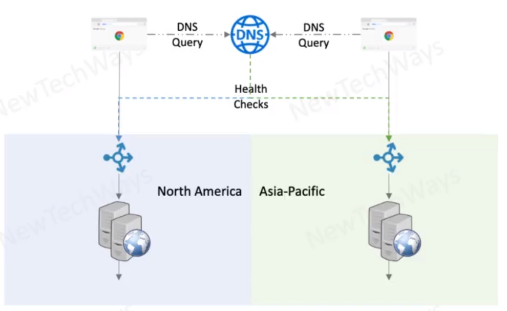

# Global Server Load Balancing

- Scalability
  - Routing for multi-geographic systems
- Performance
  - Locality for multi-geographic users
    - client to data-center latency
    - client to data-center proximity
    - data-center geography
  - high availability
    - multi region availability
  - disaster recovery

