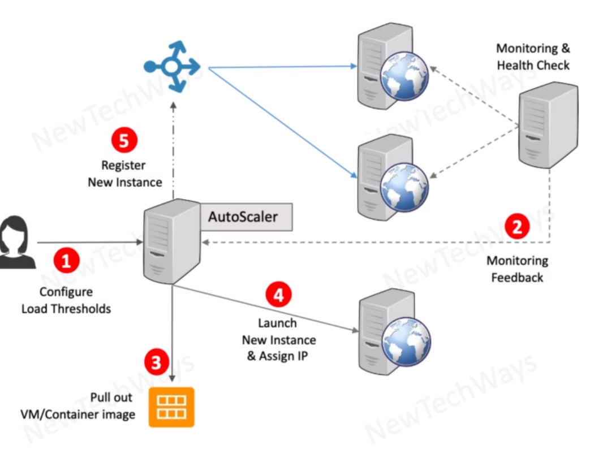

# Auto Scaling Instances

- Monitoring Service
  - Monitor Load
    - CPU
    - Network
    - Disk
  - Monitoring HEalth
    - Ping
    - Http
- Auto-Scaling Service
  - Configure load thresholds
  - monitor load
  - launch new instance
  - shutdown instance

