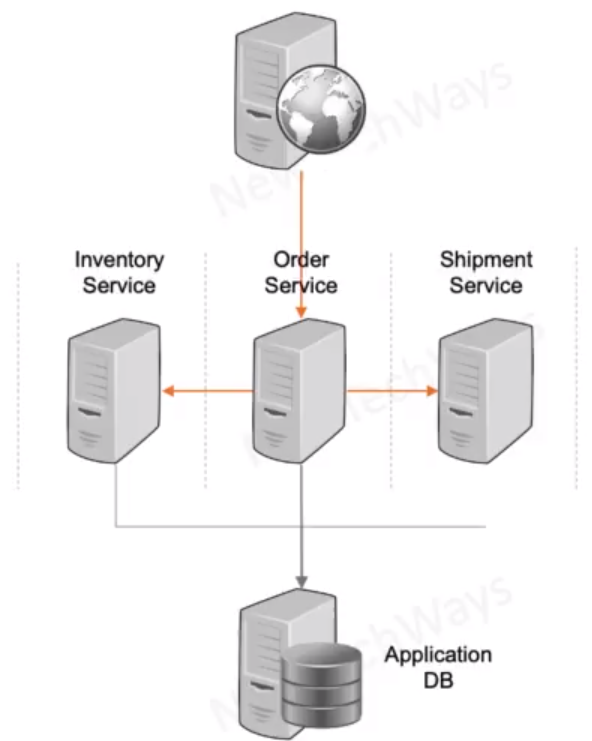

# Service Oriented Architecture

- Independent 
  - Each service can have its own technology stack, libraries, frameworks etc.
  - each service can be scaled independently and differently
- Not Independent
  - Common interface schema
    - XML schema
  - Common database schema
    - RDBMS Schema
- Issues 
  - Service development may be independent but not deployment
  - single database has scalability limitations

