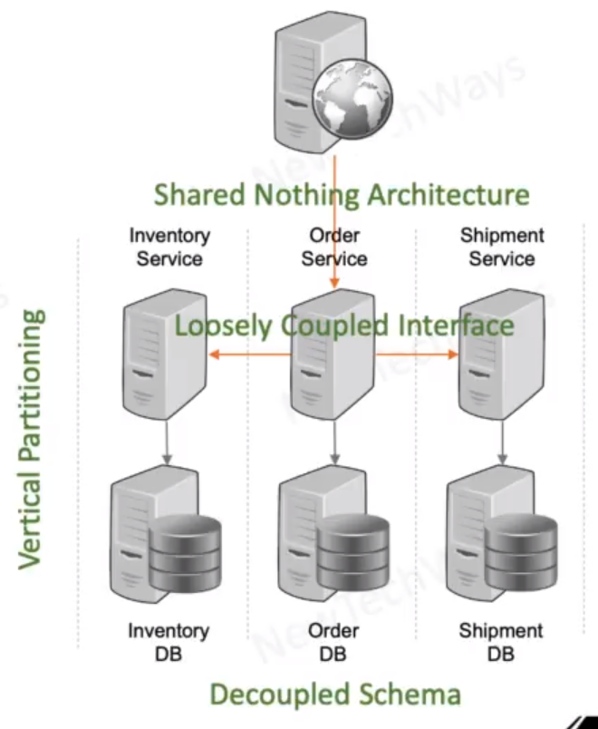

# Micro-Services Architecture Style
- Shared Nothing Architecture
  - Services developed and deployed independently
  - achieved through vertical partitioning
- Vertical/Domain Partitioning
  - independent schema/database
  - loosely coupled service interfaces
    - REST interfaces instead of XML/WSDL schemas
  - No reusability libraries except utilities
- issues
  - duplicate codebase
  - transaction failures
  - transaction rollbacks

