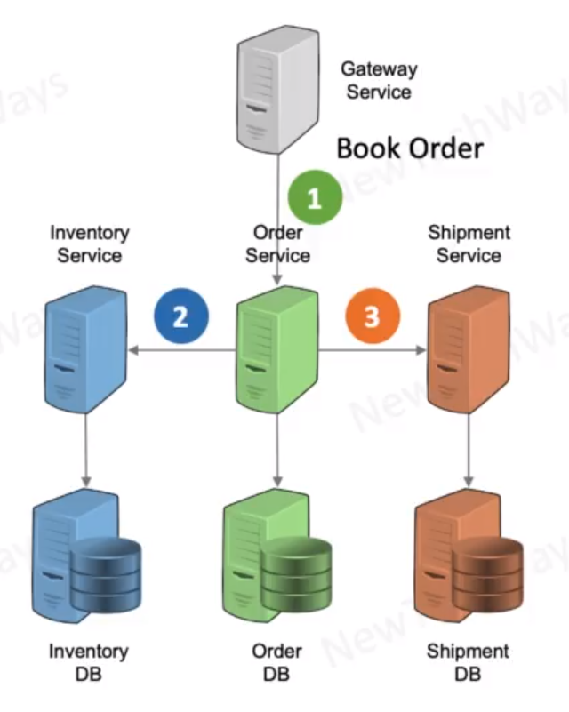

# Micro-Services Transactions

- Transaction involves multiple machines
  - distributed services with their own DB
  - local transaction not possible
- Options
  - Distributed ACID Transactions
    - 2PC/3PC
    - completely ACID
  - Compensating Transactions
    - SAGA pattern
    - Eventually consistent model
      - relaxes consistency and isolation
  

