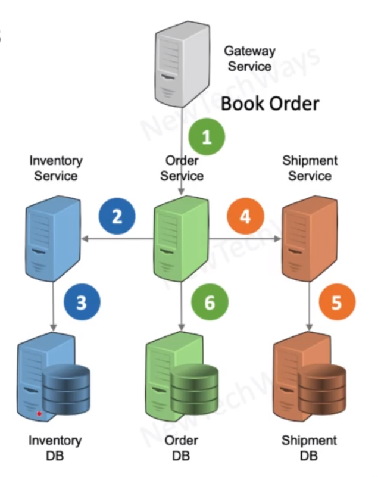
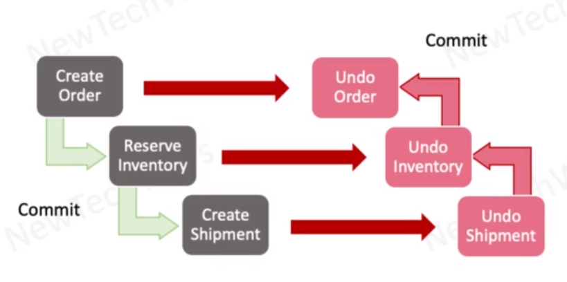

# Compensating Transactions - SAGA Pattern

- `Logical Undo` of partially committed transactions
  - flow of reversal may not be exactly opposite, and some steps can be executed in parallel
  - compensation itself can fail. Should be able to restart itself and retry
- Asynchronous processing for reliability

