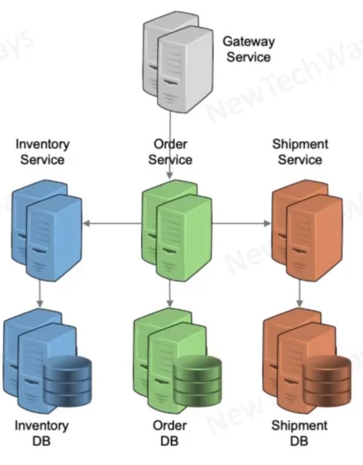

# Micro-Services Communication Model

- Synchronous processing
  - Immediate Response
  - For read/query loads
- Asynchronous processing
  - Deferred response
  - for write/transaction loads
  - higher scalability
  - higher reliability

