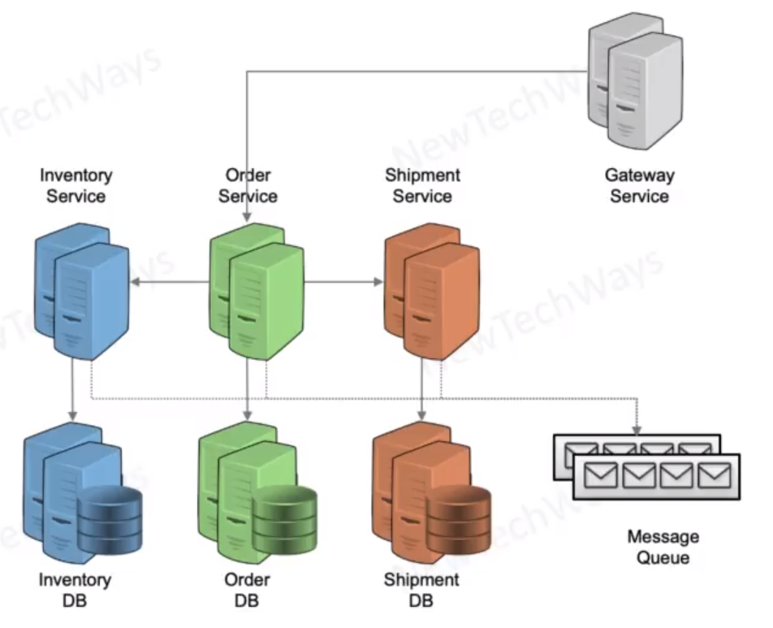

# Extreme Scalability With NoSQL & Kafka

- Microservices Transactions
  - ACID within Service
  - Compensating Transaction across services
    - eventually consistent
- NoSQL DB
  - ACID transaction at aggregate level
  - eventually consistent transactions across aggregates
  - Low latency operations
    - multiple nodes
  - high scalability
    - horizontal partitioning
- Kafka
  - Horizontal partitioning of topics

